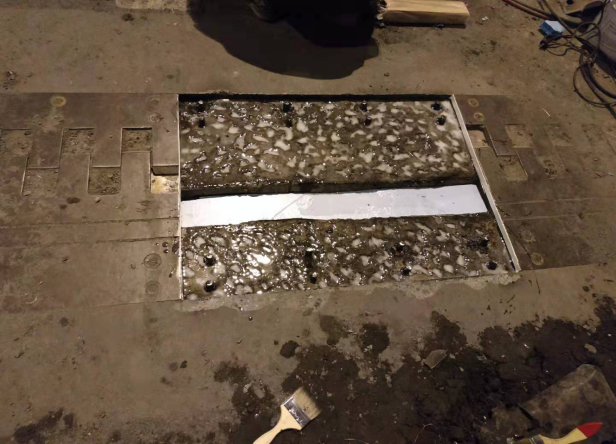

**基于全生命周期理论的道路精细化养护成套技术标准研究**

**——工艺流程编制框架**

# 巡视检查

## 1.1 路况巡查

### 1.1.1 道路日常巡视

（1）巡视内容

1）路面巡视

2）桥梁巡视

3）绿化巡视

4）附属设施巡视

（2）巡检手段

（3）工作流程

（4）资料归档

### 1.1.2自动化巡检

### （1）无人机巡视

### （2）车载智能巡视

## 1.2特殊巡查（节假日、重要活动等开展前的巡查）

### 1.2.1 节假日前保障巡视

### 1.2.2 重要活动保障巡视（防控）

## 1.3专项巡查（针对性巡查）

### 1.3.1 防汛防台

### 1.3.2 冰雪天

### 1.3.1 黄泥带

1.3.2 防团雾

## 1.4桥梁经常性检查

### 1.4.1 一般要求（人员，频次等）

一、检查质量要求

通过日常巡视检查，掌握大桥设施设备的运行状态，详细记录病缺陷发现的日期、位置、缺陷类型并及时汇总整理上报，以便第一时间安排计划进行病缺陷修复，以及为业主指令性工程、整治工程、大中修工程等各类工程提供列项依据，确保设施的正常使用服役，满足设施安全运维的基本要求。

二、检查方法及周期

大桥日常巡视检查以目视和手持式病害采集设备为主，检查大桥设施设备的运行情况是否正常。按巡检频率分日常巡检与常规巡检。日常巡检每日两次对设施设备进行巡视检查，常规巡检每月至少一次。巡检中发现缺陷及时记录并安排维修，雨雪或灾害天气时增加巡检频率。

### 1.4.2 检查内容

（1）桥面铺装

检查沥青混凝土铺装有无波浪、拥包、车辙、泛油、松散、磨光、坑槽、开裂、跳车等现象；砼铺装有无裂缝、破碎、接缝损坏；桥面及检修走道有无积尘、无杂物堆积，快速清理桥面大块垃圾。

（2）伸缩装置

一般伸缩缝检查伸缩装置是否堵塞卡死；密封橡胶带是否损坏、老化、脱落等现象，密封是否严重漏水、跳车；伸缩是否自由且在限制范围内；过渡段混凝土是否有破损；缝内是否有杂物。

大位移伸缩缝检查伸缩缝间有无积尘、硬物，是否损伤了密封橡胶带；密封橡胶带有否损坏、老化、脱落等现象；伸缩装置的钢件是否锈蚀；每月测量一次缝间距等数据，检查缝内是否有杂草、伸缩是否自由且在限制范围内。

（3）排水设施

排水管有无堵塞、损坏,有无对全部连管进行疏通，进水口盖是否齐全、平整，周围应无积水；窨井是否积泥堵塞；每月定期清理一次窨井淤泥。

（4）人行道铺装

检修道面层铺装是否起壳、破碎、有无积水。

（5）栏杆，防撞护栏

是否撞坏、断裂、松动、错位、缺件、油漆剥落、锈蚀。

（6）防护网、声屏障

防噪屏玻璃是否有破损、碎裂；插销是否缺失、锈蚀；固定防噪屏、隔物栏螺栓是否锈蚀、松动。

（7）挡土墙、护坡

检查局部混凝土是否开裂、剥落、异常变形。

（8）上部结构、下部结构

检查盆式支座的固定螺栓有否剪断，螺母是否松动，四氟板的表面是否脏污、老化；支座座板是否翘起、扭曲、断裂、锈蚀，焊缝有无开裂。钢构件有否锈蚀。

检查拉索护层是否开裂、剥落、老化脆裂；PE护层是否光滑平整，有无裂缝、破损、老化和剥落拉索护罩是否开裂或异常变形,
与人行道面层铺装连接处是否起壳、破碎；检查锚箱是否破损，对减震圈检查保养。

（9）人行天桥，照明设施等

各类照明设备工作是否正常，及时记录故障情况。

检查大桥管理范围内的电箱连接件是否紧固、是否有灰尘，检查是否损坏的元器件并及时更换。

塔内主照明巡检,并修复故障灯；对桥面主照明进行结构安全性检查，并修复故障照明。

对广场照明进行结构安全性检查。

## 1.5桥梁定期检查

### 1.5.1 常规定期检查

（1）一般要求

一、检查质量要求

（1）根据内容事先安排详细检查计划及时间安排并按计划实施。

（2）现场检查判断养护设施基本状况并记录设施基本数据。

（3）根据检查情况当场填写“大桥定期检查表”，记录各部件缺损状况，拍摄缺陷照片存档。

（4）判断缺陷产生原因，计划维修范围及方式。

（5）对难以判断损坏原因和程度的设施，安排计划进行专项检查。

（6）根据设施设备的技术状况，确定下次检查时间。

二、检查方法及周期

定期检查以目视观察为主，并借助一定工具（测量仪器、望远镜、照相机、探查工具以及现场用器材等设备）。

检查周期：按照检查内容，每年至少一次。检查中若发现混凝土出现裂缝，每月跟踪观测一次。

（2）检查内容

（1）土建设施

土建设施每年巡检内容表

| **序号** | **设施名称**         | **检查内容**                                                                                                                                                                                                                                                                                                                                                                   | **检查 周期** |
|----------|----------------------|--------------------------------------------------------------------------------------------------------------------------------------------------------------------------------------------------------------------------------------------------------------------------------------------------------------------------------------------------------------------------------|---------------|
| **1**    | **大位移伸缩缝**     | 检查滑动承压支座或滑动压紧支座是否损坏；伸缩装置的钢件是否锈蚀；大位移伸缩缝下部结构导轨保养；                                                                                                                                                                                                                                                                                 | 每年 两次     |
| **2**    | **钢筋混凝土桥面板** | 检查混凝土板是否有裂缝，是否超过最大允许缝宽，允许范围内的裂缝是否进行了封闭处理；混凝土板是否有露筋、剥落等现象；                                                                                                                                                                                                                                                             | 每年 一次     |
| **3**    | **钢梁**             | 钢梁防锈层有无起皮、裂纹、剥落、锈迹、及老化现象；结构表面是否整洁光亮，有无污垢、尘土、油、水等脏物，构件表面是否出现锈蚀；受压构件是否扭曲变形；节点联接钢板是否有滑动错位；钢梁表面清洁保养；                                                                                                                                                                               | 每年 一次     |
| **4**    | **高强度螺栓**       | 每年检查全桥螺栓20％～30％是否有松动，锈蚀现象；全桥螺栓表面清洁保养；                                                                                                                                                                                                                                                                                                         | 每年 一次     |
| **5**    | **主塔设施**         | 检查主塔钢筋混凝土有无裂缝、渗水、表面风化、剥落、露筋和钢筋锈蚀，发现主塔裂缝每月跟踪观测；检查塔顶防水层有无裂缝、渗水；检查主塔内钢结构有无锈蚀、损坏；拉索锚固钢梁承压钢板有无变形，焊缝有无开裂；拉索锚固部位的混凝土是否有裂缝、风化、剥落、露筋及钢筋锈蚀；钢锚固梁梁体是否有变形、开裂、焊缝开裂、锈蚀等现象；检查塔内照明及航空障碍灯是否齐全、有效，安全牢固无损坏； | 每年 一次     |
| **6**    | **主塔设施排水**     | 浦东浦西主塔顶清洁及排水系统疏通；                                                                                                                                                                                                                                                                                                                                             | 每年 两次     |
| **7**    | **锚头、锚箱**       | 预埋承压钢板是否锈蚀；塔端钢承压板四周的混凝土及预应力混凝土锚固梁混凝土是否松动、剥落、开裂；上锚头处是否积水；斜拉索减振装置是否失效；检查锚箱是否锈蚀、破损；锚头清洁保养，每五年上下锚头更换一次黄油；                                                                                                                                                                     | 每年 一次     |
| **8**    | **辅助墩**           | 检查混凝土表面有无裂缝、渗水、风化、剥落、露筋锈蚀、整体龟裂现象；锚固区段混凝土有无开裂，混凝土表面有无纵向裂缝；清洁辅助墩内垃圾，对辅助墩内锚头清洁保养；                                                                                                                                                                                                                   | 每年 一次     |
| **9**    | **锚固墩**           | 检查混凝土表面有无裂缝、渗水、风化、剥落、露筋锈蚀、整体龟裂现象；锚固区段混凝土有无开裂，混凝土表面有无纵向裂缝；支座是否干涩、锈蚀，螺母是否松动，清理支座表面脏污；                                                                                                                                                                                                         | 每年 一次     |
| **10**   | **边墩**             | 检查混凝土表面有无裂缝、渗水、风化、剥落、露筋锈蚀、整体龟裂现象；支座固定螺栓是否有否剪断，螺母是否松动，四氟板的表面是否脏污、老化；支座座板是否翘起、扭曲、断裂、锈蚀，焊缝有无开裂；支座表面清理；                                                                                                                                                                         | 每年 一次     |
| **11**   | **桥墩、桥台**       | 检查台背填土有无沉陷或被挤压隆起，混凝土有无裂缝，混凝土表面有无破损、风化和剥落，钢筋是否锈蚀；空心墩的通气孔是否堵塞；桥墩涂装脏污、涂画进行涂装清理；桥台有无明显沉降、倾斜现象；                                                                                                                                                                                           | 每年 一次     |
| **12**   | **盖梁、混凝土梁**   | 检查混凝土表面有无裂缝、剥落、蜂窝、麻面等病害；墩台盖梁顶面是否平整并设有流水横坡，表面有无积水，检查流水横坡是否牢固；清洁墩台表面及盖梁顶面青苔、杂草、荆棘和垃圾；钢、混凝土箱梁内照明检修保养                                                                                                                                                                             | 每年 一次     |
| **13**   | **橡胶支座**         | 检查橡胶支座是否变形、老化,梁（板）支点承压是否均匀，支座是否脱离支座垫块；                                                                                                                                                                                                                                                                                                    | 每年 一次     |
| **14**   | **照明控制箱**       | 照明控制箱检查、清扫、保养；                                                                                                                                                                                                                                                                                                                                                   | 每年 一次     |
| **15**   | **避雷针、接地电阻** | 检查主塔避雷针是否锈蚀、破损，接地电阻是否埋地、断裂；每年进行一次避雷针、接地电阻测试；                                                                                                                                                                                                                                                                                       | 每年 两次     |

（2）电力设备

电力设备每年巡检内容表

| **序号** | **检查项目**                         | **检查内容**                                                                                                                                                                                           | **检查周期** |
|----------|--------------------------------------|--------------------------------------------------------------------------------------------------------------------------------------------------------------------------------------------------------|--------------|
| **1**    | **消防泵维护**                       | 检查消防泵电机、橡胶密封圈、下盖表面等是否完好；                                                                                                                                                       | 每年四次     |
| **2**    | **空调机维护**                       | 检查空调机供水、回水阀门是否严密，开关是否灵活；检查各部位的空气调节阀门有无损坏；检查空调箱、水箱、风管等内部有无锈蚀、脱漆现象；检查配电盘各种电器接线有无松脱、发热现象；定期对空调机进行清洁保养； | 每年两次     |
| **3**    | **消防控制阀**                       | 检查消防控制阀是否锈蚀和堵塞，定期清理灰尘和杂物；                                                                                                                                                     | 每年四次     |
| **4**    | **室内消火栓维护**                   | 检查消防给水泵、消火栓、消防接合器是否完好；                                                                                                                                                           | 每年四次     |
| **5**    | **室外消火栓维护**                   | 检查消防给水泵、消火栓、消防接合器是否完好；                                                                                                                                                           | 每年四次     |
| **6**    | **室外消防接合器维护**               | 检查消防接合器的螺栓、阀门垫片、止回阀等的完好性，注意防锈和防堵塞；                                                                                                                                   | 每年四次     |
| **7**    | **电缆传输线路维护**                 | 检查光缆接头衰耗、光缆全程衰耗、电缆绝缘电阻、电缆线路直流环阻、电缆不平衡、电缆屏蔽接地的完好以及人井保洁情况达标；                                                                                   | 每年一次     |
| **8**    | **漏泄同轴电缆维护**                 | 检查漏泄同轴电缆敷设牢固性、环路直流电阻的完好；                                                                                                                                                       | 每年四次     |
| **9**    | **漏泄同轴电缆维护**                 | 检查内外导体间绝缘电阻、电压驻波比VSWR、衰减、耦合损耗Lc、钢丝承力索的垂度调整的完好；                                                                                                                 | 每年一次     |
| **10**   | **干式变压器维护**                   | 检查各固定接头的完好；                                                                                                                                                                                 | 每年一次     |
| **11**   | **真空断路器维护**                   | 检查真空断路器结构固定是否松动、外表保洁情况达标，电气连接是否可靠、接触是否良好，操动机构的联动是否正常、分合闸状态指示是否正确，绝缘部件，瓷件是否完整、缺损以及真空灭弧室情况的完好；               | 每年一次     |
| **12**   | **负荷开关维护**                     | 检查动、静触头工作位置是否异常，接地线连接是否可靠，完好，传动操作机构零部件是否正常；                                                                                                                 | 每年一次     |
| **13**   | **10KV配电柜辅助元件及联锁装置维护** | 检查“五防”装置是否完好、动作是否有效，接地开关是否完好，柜体外壳、接地是否完好，柜体内是否整洁；                                                                                                       | 每年一次     |
| **14**   | **电容柜维护**                       | 检查手控、自控装置回路、放电回路、绝缘、接地，构架，外壳等是否完好以及接地电阻；                                                                                                                       | 每年一次     |
| **15**   | **接地装置维护**                     | 检查电气设备与接地线、接地网的连接有无松动；                                                                                                                                                           | 每年两次     |
| **16**   | **接地装置维护**                     | 检查接地或接零导线有无损伤、腐蚀、断股，接地装置、接地电阻值是否正常；                                                                                                                                 | 每年一次     |
| **17**   | **避雷设备维护**                     | 避雷器维护                                                                                                                                                                                             | 每年两次     |
| **18**   | **避雷设备维护**                     | 接地电阻测试                                                                                                                                                                                           | 每年一次     |
| **19**   | **控制柜维护**                       | 检查电气元件、机械闭锁、电气闭锁、动触头、静触头、辅助开关、信号灯、光字牌、电铃等完好，检查端子排、柜内配线、启动水泵完好以及控制柜内外达到清洁标准；                                                 | 每年两次     |
| **20**   | **控制柜维护**                       | 继保整定                                                                                                                                                                                               | 两年一次     |
| **21**   | **电机维护**                         | 检查电机轴承温升不超过允许值，检查电机绝缘电阻应符合安全运行要求，电机引出线接头螺栓应紧固以及接地装置必须紧固，可靠；                                                                                 | 每年四次     |
| **22**   | **电力电缆**                         | 电力电缆接头及绝缘层有无过热、损坏现象、金属支架牢固否等；                                                                                                                                             | 每年一次     |
| **23**   | **变压器**                           | 变压器运行声音正常否、主要指示仪指示范围正常否、温度正常否、排风设施正常否、测温装置正常否、保护装置正常否；                                                                                           | 每年一次     |
| **24**   | **电力电容**                         | 电力电容外壳有无鼓起、示温片正常否；                                                                                                                                                                   | 每年一次     |
| **25**   | **消防器具**                         | 检查消防给水泵、消火栓、消防接合器是否完好                                                                                                                                                             | 每年一次     |
| **26**   | **供水管道、泵房**                   | 供水管道、箱巡检、保洁、养护、防冻包扎；检查泵房间各类水泵运转是否正常；                                                                                                                               | 每年一次     |
| **27**   | **应急电话**                         | 检查应急电话机箱体及支架是否完好、固定是否牢固，进出线是否损坏，通话是否畅通；                                                                                                                         | 每年一次     |

### 1.5.2 结构定期检测

#### （1）检测要求及规范

《城市桥梁养护技术规范》规定，斜拉桥应定期进行结构健康检测，以保障桥梁完好和安全运营。引用的规范如下：

1）《城市桥梁检测与评定技术规范》(CJJ/T 233-2015)；

2）《城市桥梁养护规范》(CJJC99-2003)；

3）《混凝土中钢筋检测技术规程》(JGJ/T 152-2008)；

4）《回弹法检测混凝土抗压强度技术规程》(JGJ/T 23-2011)；

5）《混凝土结构现场检测技术标准》(GB/T 50784-2013)；

6）《水运工程混凝土试验规程》(JTJ 270-1998)。

#### （2）检查检测周期

| **序号** | **类别** | **内容**                                 | **频次**                                                      |
|----------|----------|------------------------------------------|---------------------------------------------------------------|
| **1**    | **道路** | 路面平整度检测                           | 1次/年                                                        |
| **2**    | **道路** | 路面抗滑指标检测                         | 1次/年                                                        |
| **3**    | **道路** | 路面结构强度检测                         | 1次/年                                                        |
| **4**    | **大桥** | 大桥桥墩沉降监测                         | 1次/年                                                        |
| **5**    | **大桥** | 斜拉索力检测                             | 1\~2次/年                                                     |
| **6**    | **大桥** | 大桥线型检测                             | 1次/年                                                        |
| **7**    | **大桥** | 砼裂缝检测，根据缺陷程度而定             | 一般1次/月，属于跟踪观测                                      |
| **8**    | **大桥** | 砼碳化、强度、氯离子侵蚀检测             | 1次/年                                                        |
| **9**    | **大桥** | 支座、阻尼器、大位移伸缩缝、高强螺栓检测 | 支座、阻尼器每年检查一次、伸缩缝每年2次、高强螺栓每年20%\~30% |

#### （3）检查检测项目内容

1）斜拉索索力检测

A.频率法测量拉索索力

采用环境随机振动法，即利用环境随机激励，测出每根斜拉索的若干阶自振频率，然后根据每根斜拉索的长度、单位索长的质量、斜拉索的抗弯刚度、两端的边界条件以及斜拉索的振动频率，从而计算出每根斜拉索的索力。作业时运行掌上电脑检测软件，将传感器捆绑于斜拉索上面，通过蓝牙技术将数据信号传输至掌上电脑，完成对外业数据的采集，并实时计算出斜拉索索力数值。

B.索力数据分析

斜拉索索力值需要与上一年拉索测定值及竣工时测量值进行对比，以相对变化幅度超过5%为异常值，测量索力值超过报警值要经二次测量验证。对本年度索力值变化情况进行分析并整理成报告。

2）混凝土强度检测

A.人员组织及仪器设备

检测由我公司自行完成，主要检测人员具有5年以上城市桥梁专业主管资格。采用回弹仪对混凝土强度进行检测，检测前对仪器送检测中心检验合格后方可使用。

B.检测位置

每根桥墩选取一个面作为测区，主桥面底板等根据实际选取5至9个测区。

测区面应为混凝土表面，并应清洁、平整、不应有疏松层、浮浆、油垢及蜂窝、麻面，
必要时可用砂轮清除疏松层和杂物，且不应有残留的粉末或碎屑；若检测面有涂装层，则将涂装层打磨干净，露出混凝土表面后进行测试。

C.检测方法

测区尽量选在使回弹仪处于水平方向检测混凝土的侧面。根据回弹测试结果推定混凝土强度，并根据构件本身混凝土强度进行状况评定。

D.内业资料整理分析

汇总检测结果，参考相关规定进行钢筋保护层厚度的评定，分析大桥重要结构混凝土的健康状况。

3）砼裂缝检测

A.人员组织及仪器设备

检测由我公司自行完成，主要检测人员具有5年以上城市桥梁专业主管资格，采用裂缝测宽尺、裂缝测宽仪器。

B.检测位置

检查位置主要为桥墩及构件地面附近，或人眼可及范围内。主桥面下底板根据实际抽检10至20跨。

C.检测方法

裂缝检查主要以目视检查为主，自制裂缝测宽尺比对裂缝宽度。当裂缝测宽尺测得裂缝宽度大于0.2mm时，使用裂缝宽度测试仪复测。发现的裂缝一般采用记号笔进行标注，标注方式为距裂缝20mm～30mm宽位置重绘裂缝，并记录缝宽及检查时间，宽度大于0.2mm时，裂缝独立编号记录位置，以方便持续观察。

D.内业资料整理分析

根据检测位置，编制裂缝检测记录，记录裂缝位置、长度、宽度等数据。每月进行跟踪观测裂缝宽度大于0.2mm的裂缝发展趋势。汇总检测结果，参考相关规定进行钢筋保护层厚度的评定，分析大桥重要结构混凝土的健康状况。

4）混凝土碳化、强度、氯离子侵蚀检测

A.人员组织及仪器设备

检测由我公司自行完成，部分检测项目送第三方专业检测机构进行理化试验分析，主要检测人员具有5年以上城市桥梁专业主管资格。采用仪器：回弹仪、酚酞溶剂、混凝土氯离子含量测定仪等，检测前将仪器送检测中心检验合格后方可使用。

B.检测位置

主桥桥面板、大桥主塔内部及外部、辅助墩、锚固墩、边墩外外部、每条引桥部分桥墩及桥面板。

C.检测方法

使用75％的酒精溶液与白色酚酞粉末配置成的浓度为1～2％的酚酞溶剂，将其喷在混凝土的新鲜破损面，根据指示剂颜色的变化，用以测量混凝土的碳化深度，量测精度准确至毫米。混凝土强度检测采用超声回弹综合法，对检测位置进行混凝土强度检测。采用离子选择电极法，对检测位置进行混凝土氯离子含量进行检测。

D.内业资料整理分析

对检测位置的混凝土碳化、强度、氯离子侵蚀情况进行汇总，根据混凝土评定标准分析大桥混凝土结构的健康状况。

5）钢筋保护层厚度检测

A.人员组织及仪器设备

检测由具有相应资质的专业单位承担，主要检测人员具有5年以上城市桥梁专业主管资格。检测仪器：钢筋混凝土保护层厚度测定仪，手持混凝土雷达。

B.检测位置

主桥桥面板、大桥主塔内部及外部、辅助墩、锚固墩、边墩外外部、每条引桥部分桥墩及桥面板。

C.检测方法

采用非破坏性检测方法确定其保护层厚度，利用混凝土保护层厚度测定仪，量测值准确至毫米。

D.内业资料整理分析

汇总检测结果，参考相关规定进行钢筋保护层厚度的评定，分析大桥钢筋保护层厚度的健康状况。

6）主筋锈蚀情况检测

A.人员组织及仪器设备

检测由具有相应资质的专业单位承担，主要检测人员具有5年以上城市桥梁专业主管资格。检测仪器：钢筋锈蚀仪。

B.检测位置

主桥桥面板、大桥主塔内部及外部、辅助墩、锚固墩、边墩外外部、每条引桥部分桥墩及桥面板。

C.检测方法

采用半电池电位法进行测试,根据用钢筋定位仪测定的钢筋分布确定测线及测点，测点的间距为10～20cm。用钢筋锈蚀测定仪逐个读取每条测线上各测点的电位值.由测点的电位值评估钢筋锈蚀状态。

D.内业资料整理分析

汇总检测结果，参考相关规定进行钢筋保护层厚度的评定,分析大桥主筋保护层现状。

### 1.5.3 检测新技术

#### （1）桥梁水下结构检查检测

一、水下视频检测的方法

    水下摄像系统一般包括水下摄像机/摄像探头、传输线缆和图像采集设备，水下摄像机和连接线缆要求具有水密性。水下视频检测系统检测时将水下摄像机/摄像探头下放至水下待检测的部位，水下摄像机连接的数据线缆将图像传输至图像采集设备，通过图像采集设备来显示摄像机在水下的位置以及实时采集的图像。在实施桥梁水下检测时图像采集设备可以进行全过程的录像，检测人员可以通过视频播放来进行后续结构病害的分析，此外在检测时发现结构的病害可以进行视频的截屏，并记录病害的位置以及截屏病害图像的编号。

二、水下机器人检测的方法

    前面在介绍水下视频系统时介绍了机器人搭载视频系统的方式，此外水下机器人检测桥梁水下结构时还可以搭载超短基线定位系统、单波束声呐、多波束声呐系统进行水下结构物的扫描、定位和测量工作。

采用水下机器人搭载视频及多波速二维扫描声纳扫描成像的方法进行水下结构物的检测。该系统主要功能应包括以下几个方面：

1、水下机器人（ROV）：能够下潜深度满足水下检测要求，能够通过控制台控制机器人的运动，机器人应采用观察级机器人；

2、机器人应配备导航定位系统，目前通长采用超短基线水声定位系统。

3、视频监控系统：该系统主要搭载在机器人上对结构物的进行监测，视频系统能通过控制系统的显示屏进行适时显示，并按要求能进行控制拍摄结构损伤、缺损的照片或视频资料；

4、二维多波速声纳：在水质混浊或想获得结构物缺损详细资料时，声纳对结构物进行二维扫面，对结构的缺损进行相对精细的扫描。

5、水下机器人应配备机器手
水下检测可能会在水中遇到复杂的检测环境，配备基本的机器手可以在检测过程中进行必要的控制和操作。

三、水下三维激光扫描系统

目前，虽然水下激光扫描测量系统的作用距离还比较近，但其百倍于声纳的分辨率使得该革命性的技术的应用前景非常广阔，国外已经广泛用于水下建模、仿真、目标重建、水下结构检测、大坝桥梁安全评估、海洋油气、核电站检测、管道变形检测等领域。水下激光三维扫描产品目前最好的产品水下激光扫描仪精度能达到mm级，但其测试距离距结构物距离较近，测试距离在1\~5m，而且测试的点云数据在构建实体模型需要通过CAD或其它专用软件进行处理。

通过三维激光扫描仪安放在待测桥梁结构物附近的不同的测站进行三维扫描，并将不同测站的数据拼接进行点云数据的建模可以实现对结构物的检测。三维激光扫描技术在实际桥梁水下结构的应用案例较少。

四、声呐检测技术

目前国内外水下目标声纳探测技术已经有很大的进步，出现了很多不同类型、功能各异的声呐，其中具有高测量效率、高测量精度、高分辨率的多波束勘测技术适合于大面积的水下测绘作业。侧扫声纳也是人们常用的水下探测工具。它分为低频侧扫声纳、高频侧扫声纳和双频侧扫声纳。低频侧扫声纳非常适合于对水下管线、大推进器、沉船等进行搜索定位。高频侧扫声纳可提供高分辨率的图像，尽管其作用距离比低频侧扫声纳近一些，但较低频系统能更详细地显示目标的细微特征，双频侧扫声纳同时具有低频系统的远距离和高频系统的高精度两个优点。此外还有合成孔径声呐扫描技术也可以用于水下结构物的检测。

#### （2）铰缝破损自动化检测

1)研发背景

铰缝的病缺害随着桥梁运行年限的增长，发生的几率逐年增加。公司研发的铰缝检测机器人就是为了应对这一现状而生的一种新型铰缝检测装置，以便作业时更加快速、高效和简便。

2)方案对比

传统方法需要通过膨胀螺栓及支架将检测机器固定在空心板梁上，不仅准备时间较长，而且会对混凝土板梁造成一定的破坏。

铰缝检测机器人能有效地减少对结构的破坏，通过系统搭载的登高平台可以方便地改变检测位置，更加高效，同时也可以更加快捷地移动设备，提高了使用的方便性。

3)技术简介

铰缝检测机器人包括小型登高平台，通过搭载方便了整体的运输及使用。检测部分使用高精度激光传感器和三维运动控制器高速测量来不间断记录大数据，能更好地检测和分析桥梁空心板梁之间铰缝的破损程度。

<strong>铰缝检测机器人实物图</strong>

 

)

<strong>现场作业图</strong>

## 1.6桥梁健康监测

人工监测桥梁变形状况工期冗长，基本上每年进行一次，时效性差，而桥梁健康监测系统通过在结构关键部位布设传感器，利用在线采集、传输、处理技术，随时掌握大桥在正常运营中任意工况下的结构内力、变形状态及损伤情况，根据结构健康指标长期变化规律进行分析和预判，以便尽早发现桥梁结构面临的危险状况，为桥梁结构的养护维护提供科学依据，实现真正意义上的预养护。

通过安装 GPS
监测装置，对基础沉降和桥塔、主梁关键部位的位移进行实时和长期的在线采集，实时掌握大桥塔顶位移和主梁挠度，获取关键部位变形规律。再如通过位移、加速度等指标的在线采集和实时分析，实时把握桥梁动力特性和振动水平，洞察结构内在特性的渐变，判定结构的整体安全。

## 1.7隧道经常性检查

## 1.8隧道定期检测

# 道路保洁

## 2.1 机械清扫

## 2.2 人工捡拾

## 2.3设施清洗

## 2.4撒落物清理

## 2.5小广告清除

# 路基养护

## 3.1 路肩养护

## 3.2 边坡养护

## 3.3 挡土墙养护

## 3.4 防护结构养护

## 3.5 路基翻浆处理

## 3.6 排水设施养护

# 沥青路面养护

## 4.1 沥青路面日常保养

## 4.2 沥青路面沉降观测

## 4.3 沥青路面预养护

## 4.4 沥青路面裂缝处治

## 4.5 沥青路面坑槽处治

## 4.6 沥青路面车辙处治

## 4.7 沥青路面沉陷处治

## 4.8 沥青路面破浪拥抱处治

## 4.9 沥青路面松散处治

# 水泥路面养护

## 5.1 水泥路面日常保养

## 5.2 水泥路面接缝处维修

## 5.3 水泥路面裂缝维修

## 5.4 板角断裂、边角剥落维修

## 5.5 破损板换板维修

## 5.6 板块脱空处治

## 5.7 唧泥处理

## 5.8 错台处治

## 5.9 水泥路面坑洞处治

## 5.10 水泥路面拱起处治

## 5.11 水泥路面沉陷处治

# 人行道养护

## 6.1 人行道面层

## 6.2 人行道基层

## 6.3 路缘石及平石养护

## 6.4 人行天桥养护

# 桥梁养护

## 7.1 桥面系及附属设施养护

### 7.1.1 桥面铺装层

#### 7.1.1.1 沥青路面养护

**一、沥青路面预养护**

**（1）工艺概述及适用条件**

部分路段沥青路面存在轻微裂缝、麻面病害，平整度、车辙等指标呈衰减态势，若不及时处治将对路面使用寿命与性能产生不利影响。为保持及提高路面使用性能、延长路面使用寿命，故此采取沥青路面预养护措施。

采用沥青再生材料将沥青路面密封以抵抗燃油、水、紫外线和化学剂等外来杂质侵蚀的同时，它的化学性能渗透沥青表层下
2
厘米或更深，将路面已老化的沥青再生，恢复其原有性能，同时也适合让新沥青路面得到更佳的长期养护。

**（2）工具设备及材料**

| **机械设备**  | **型号**      | **数量** | **用途**              |
|---------------|---------------|----------|-----------------------|
| 路沥新®洒布车 | 美国Desco-200 | 2部      | 喷洒原料              |
| 10吨大货车    | 东风天龙      | 1辆      | 运输洒布车及相关材料  |
| 华晨金杯      | 11座          | 1辆      | 运送作业人员          |
| 防撞缓冲车    | 徐工          | 1辆      | 施工防护              |

**（3）施工流程图**

**（4）工序介绍**

>   1)第一道工序：施工准备

>   2)第二道工序：原路面清扫——施工当天据场情况选择使用空气压缩机将路面吹干净或清扫净。

>   3)第三道工序：原路面检测

>   4)第四道工序：标线贴缝保护——需要保留路面的标志线用胶带盖住，以免被沥再生®材料覆盖。

5)第五道工序：机械局部预洒——确定喷洒量。

6)第六道工序：洒布机喷洒——使用洒布机喷洒路面时，应严格要求用量（材料用量应视沥青路面老化程度而定，按照0.2kg/㎡）均匀喷涂。

7）第七道工序：人工补刷——洒布机未能喷到的狭窄地方用人工均匀补上。施工完毕后，除去胶带纸，清理施工现场。

8）第八道工序：养护

9）第九道工序：对比检测

10）第十道工序：开放交通

**（5）工艺视频**

**（6）质量验收**

1）质量要求：沥青路面预养护的质量控制应符合如下规定。

完工后3个月钻芯取样，切取表面1cm范围内的沥青混合料，根据《公路工程沥青及沥青混合料试验规程》（JTGE20-2011）有关试验方法，抽提、回收沥青材料进行试验，沥青材料应满足下表技术要求。

**沥青还原处治路面表层材料技术要求**

| **试验项目**               | **要求值 【（沥青再生指标-老化沥青指标）/老化沥青指标】\*100** | **试验方法** |
|----------------------------|----------------------------------------------------------------|--------------|
| 针入度比（25℃，5s，100g）% | ≥20                                                            | T0604        |
| 延度比（15℃，5cm/min）%    | ≥25                                                            | T0605        |
| 软化点比（环球法）%        | ≤-10                                                           | T0606        |

项目完工后沥青路面应满足下表的相关技术要求。

| **检查项目** | **质量要求及检验标准**           | **检验频率**       | **检验方法**  |
|--------------|----------------------------------|--------------------|---------------|
| 表观鉴别     | 喷洒均匀，无流淌、空隙和条痕现象 | 连续观察           | 目测          |
| 洒布用量     | 设计值的-5%，+10%                | 1次/每车           | T0982         |
| 渗水系数     | \<50ml/min                       | 1点/200m           | T0971         |
| 构造深度     | ≥原路测试值的90%                 | 1点/200m           | T0961         |
| 抗滑系数     | 平均不低于原路测试值3BPN         | 1点/200m或全线连续 | T0964或检测车 |

**二、星封层技术及工法（延缓路面衰老）**

**（1）工艺概述及适用条件**

STAR SEAI
SUPREME是一种沥青路面封涂层，用于延缓沥青路面衰老，保持沥青路面年复一年后仍然出色的质量和外观。它是用高温精练的煤沥青做基质，含有精选的矿物填料、表面活性剂和多种自有知识产权的添加剂，喷洒到沥青路面后，在表层形成了一层坚韧、耐用、有弹性和卓越抗湿性的封涂层，从而保护了沥青路面不受空气氧化和紫外线辐射的侵害。它的抗湿性使路面不受气候、水、盐和其它物质的渗入；同时阻止了汽、柴、轻油及大量化学物质制品的侵蚀软化和损坏沥青路面。

适用范围：地基、平整度较好的黑色沥青路面桥面，车辙严重、原路面如镜面等摩擦力严重不足的不建议使用。

**（2）工具设备及材料**

**（3）施工流程图**

**（4）工序介绍**

1）第一道工序：现场准备——首先对路面进行清洁，去除所有异物的碎屑（泥土、沙砾、泥砂等）再用吹风机吹去浮尘、泥土或泥沙，可以用扫帚清除，对油污较多区域可用3倍清水彻底稀释过的STAR
SEAL SUPREME喷洒或手工涂刷。待彻底干透后再喷洒SUPREME混合料。

STAR SEAL
SUPREME不能在雨天或雾天施工，施工前后的路面和空气温度必须在10℃之上，如路表温度高于37.8℃建议可用细水雾弄湿路面后再喷洒混合料，相对湿度最好低于60%，最高80%。

新建公路要对路面进行处理，使表面没有集中的油污，用热混沥青铺设后至少等待90天（白天温度超过21.1℃）才可铺SUPRENE。也可以用水膜残迹试验来确定路面油污已被减少或去除。往待试验的路面上浇5公斤水。如水均匀地流动开来，没有出现流动缓慢或油污造成的环形（水珠浮在油上），就可以铺洒保护性涂层，即SUPREME
。

**路面清洁**

2）第二道工序：标线和设施配套保护——清扫完毕后，根据业主方要求，若要保留原有标线，则用特定尺寸的胶带保护好标线、箭头、文字等。胶带尺寸为根据标线尺寸定制的16公分和22公分。对于保护路沿石清洁，绿化不受污染等，则需要用挡板遮挡喷杆边缘，以防止强大压力下喷溅出的雾状细料造成黑色污染。

**标线**

3）第三道工序：现场材料拌合

4）第四道工序：喷洒第一遍——按设备介绍中的方法，根据需要的宽度开启喷嘴数量，一次最宽可喷3.75米，喷涂量为每分钟200—210公斤，喷涂速度每小时3.2-3.5公里，覆盖面积每分钟约200平方米。

5）第五道工序：喷洒第二遍——对于路面构造深度大于4.5—6㎜的路面可选用喷涂3层混合料的方法；以延长该材料的寿命。而对路面构造深度4.5㎜以下的路面可采用喷涂两层混合料；喷涂两层混合料的做法适合大部分高速公路；构造深度小于4㎜的路面，亦可喷洒一层的混合料（一层和两层的维持寿命将减半或更多）。构造深度小于4㎜的路面，也可选用纯SUPREME再添加20%可饮用的水直接喷洒在路面上，它最大的优势是不降低构造深度，并能同样发挥该材料的功能。

SUPREME按两层的量喷涂于路面上，日交通量在5万辆次的道路上，有效功能期为4-5年。在一条路有效的生命周期中每隔4-5年喷洒一次，可延长道路的使用寿命300%。

用有柄鬃刷涂刷（限于小范围使用）如需涂第二层，应尽可能地沿第一层的垂直方向涂刷。

**机械喷洒**

6）第六道工序：等待干燥——在材料允许的气候条件下，零上10℃—37.8℃，湿度低于60%不高于80%的情况下，为了加快干燥时间，可添加2%—3%的STARMACRO-FAST（快干剂）。正常情况下喷洒完第一层后干燥1小时后即可喷洒第二层，在有阳光的情况下，约6小时即可开放交通。

7）第七道工序：清除围栏开放交通

**（5）工艺视频**

**（6）质量验收**

1）质量控制标准：星封层技术及工法要求严格执行《公路沥青路面养护技术规范》、《公路养护安全作业规程JTG
H30-2004》和《企业质量手册》相关要求并达标。

预养护相关标准值表

| 项目| 质量要求| 检测方法 | 参考标准  |
|----|--------|---------|-------|
| 表观质量 | 外观 | 整体呈均一深碳黑色、无漏白现象         | 目测，全线连续            |
| 结构性   | 原沥青表面构造清晰、无堵塞、无镜面现象 |                           |             |
| 抗滑性   | 摆值BPN/横向力系数   | 原路面降低不超过10%   | 摆式摩擦仪/道路一体检测仪 | T0964       |
| 构造深度    | 降低不超过0.1MM          | 铺砂仪/道路一体检测仪     | T0961/62/63 |
| 渗水系数 | 90%渗水系数为0，路面基本不渗水 | 渗水仪  | T0971 |

2）质量保证措施：①施工结束，按施工安全和作业要求摆放了维护锥标的作业区应该完全封闭，由安全人员维护疏导交通，禁止不相关车辆、电动车、自行车的驶入，过往车辆应限速30-40公里/小时。②达到4-6小时，材料完全干燥后，方可按秩序撤退施工人员、锥标和车辆，安全员确保从头至尾维护交通秩序和现场安全，最终正常开放交通。

**三、抗滑雾封层工法（路面预防性养护）**

**（1）工艺概述及适用条件**

针对路面状况特征，采用预防性养护工艺---抗滑雾封层，能够一定程度上恢复原路面性能，延缓沥青路面病害的发生，延长沥青路面的使用寿命，提高路面安全性能。采用了粘结性、渗透性、抗老化性及高低温性能优良的专用雾封层黏结料，确保了该雾封层同时具备良好的封水和粘结功能，对原路面的轻微裂缝、贫油、老化、粉细料散失、轻微松散等都有显著的改善作用。由于抗滑雾封层实体厚度薄，在单车道施工时对路面排水无影响，加之单位面积的材料重量轻，也可应用于各类型桥面沥青混凝土铺装层的预养护。

本工艺适用于无结构性病害的各等级公路沥青路面、桥面的表面防水层、磨耗层。

**（2）工艺设备及材料**

1）抗滑雾封层选用的高浓改性粘结剂，其指标应符合下表的技术要求。

**高浓改性粘结剂技术要求**

| **试验项目**           | **单位**                  | **指标要求** | **试验方法** |       |
|------------------------|---------------------------|--------------|--------------|-------|
| 筛上剩余量（1.18mm）   | %                         | ≤0.1         | T0652        |       |
| 恩格拉粘度E25          | —                         | 1～10        | T0621        |       |
| 与集料粘附性，裹覆面积 | —                         | ≥2/3         | T0654        |       |
| 固化物含量             | %                         | ≥63          | T0651        |       |
| 固化物软化点   |    ℃       | ≥57  | T0606 |
| 粘韧性，（25℃，50cm/min） | N.m          | ≥5           | T0624 |
| 韧性，（25℃，50cm/min）   |  N.m          | ≥2.5     | T0624 |
| 弹性恢复                  | %            | ≥60          | T0662 |

2）抗滑雾封层的集料建议采用辉绿岩、玄武岩，当地在缺乏以上石料的情况下可选择安山岩、闪长岩、片麻岩、石灰岩、花岗岩等，但集料的技术指标都必须满足下表要求。其最大粒径应与处治层的厚度相同，集料应经过水洗并风干，且不含杂质，针片状含量不大于15%。

**抗滑雾封层用集料技术要求**

| **指     标**  | **单位** | **技术要求** | **试验方法** |
|----------------|----------|--------------|--------------|
| 集料的压碎值   | ％       | ≤26          | T 0316       |
| 洛杉矶磨耗损失 | ％       | ≤28          | T 0317       |
| 坚固性         | ％       | ≤12          | T 0314       |
| 针片状颗粒含量 | ％       | ≤18          | T 0312       |
| 含泥量         | ％       | 1            | T 0310       |
| 软石含量       | ％       | 3            | T 0320       |

3）抗滑雾封层的主要施工设备包含专用作业车（能均匀撒布小粒径碎石）、稳压回收车、沥青洒布车、集料筛分设备、强力清刷机等。采用的机具设备见下表。

** 机具设备表**

| **序号** | **设备名称** | **单位** | **数量** | **用途**             |
|----------|--------------|----------|----------|----------------------|
| 1        | 同步封层设备 | 辆       | 1        | 抗滑雾封层专用作业车 |
| 2        | 稳压回收车   | 台       | 1        | 碾压回收             |
| 3        | 沥青洒布车   | 台       | 1        | 稳固层洒布           |
| 4        | 集料筛分设备 | 台       | 1        | 集料精筛选           |
| 5        | 清扫机       | 台       | 2        | 清扫                 |
| 6        | 双排工具车   | 把       | 2        | 辅助施工             |
| 7        | 防撞车       | 把       | 1        | 安全封道             |
| 8        | 封道工具车   | 把       | 1        | 安全封道             |
| 11       | 零星工具     | 把       | 若干     | 辅助施工             |

**（3）施工流程图**

**（4）工序介绍**

1）第一道工序：施工路段封闭、清扫、及标线防护（必要时）——抗滑雾封层施工前应进行交通管制，清理所有工作面上的泥浆、油污等杂物，必要时使用高压水或风机进行清理。保护标线设施，为防止施工对路面标线造成污染。

2）第二道工序：抗滑雾封层施工——①专用作业车应保证高浓改性粘结剂喷洒均匀、喷洒后在路面形成等厚度的薄膜，喷洒过程中应保持材料温度在合适的温度区间，且喷洒高度适宜。碎石撒布应均匀一致，局部缺陷采用人工处理。②专用作业车施工过程中要保持车速稳定，走线顺直。在施工的起点和终点要铺设油毡以保证起点和终点整齐美观，避免污染施工区外的路面。③施工速度不宜过快，一般为5km/h左右。

3)第三道工序：碎石碾压及回收——撒布完成后及时跟进碾压，碾压时以6km/h速度碾压1～2遍，使用专用稳压回收车进行碾压。碾压结束后，对表面多余集料使用专用余料回收车进行回收。

4)第四道工序：稳固层粘结料洒布——采用沥青洒布车进行表层粘结料的洒布。洒布车走线要顺直，车速要稳定。

5）第五道工序：养生——稳固层粘结料洒布后进行二次养生，养生期内禁止任何车辆驶入路面。

6）第六道工序：开放交通——待养生成型后，即可开放交通。

**（5）工艺视频**

**（6）质量验收**

1）质量控制标准

**质量检验标准**

| **项目**             | **质量要求**                         | **检测频率** | **方法** |
|----------------------|--------------------------------------|--------------|----------|
| 表观状况             | 表面平整、均匀、密实、无松散、无脱落 | 全线连续     | 目测     |
| 宽度                 | 满足设计要求                         | 5个点/km     | 米尺测量 |
| 渗水系数（ml/min）   | ≤50                                  | 5个点/km     | T0971    |
| 摆值Fb（BPN）        | 高速公路、一级公路 ≥45               | 5个点/km     | T0964    |
| 横向力系数           | 高速公路、一级公路 ≥54               | 全线连续     | T0965    |
| 构造深度（TD）（mm） | 高速公路、一级公路 ≥0.55             | 5个点/km     | T0961    |

注：横向力系数和摆值任选一项作为检测要求。

2）质量保证措施:①施工前对原路面的病害进行调查、检测，并采取合理的处治方式对病害进行处理。②根据施工方案对材料的技术要求确定料源，样品送交试验室进行性能检测，并妥善储存。③高浓改性粘结剂洒布量的确定，设计高浓改性粘结剂洒布量的计算一般要考虑交通特性、表面构造、集料吸附性、表面刚度、气候、集料选择等情况后，在基本洒布量的范围内作调整。④碎石选择及撒布量的确定，所用的碎石宜采用单粒径石料，根据降雨量和原路面构造选择合适的粒径。可以采用石灰岩、花岗岩、玄武岩等，碎石的撒布量根据选择集料的密度和覆盖率确定。⑤根据设计的材料用量对施工设备进行调试和标定。⑥专用作业车应保证高浓专用粘结材料喷洒均匀、喷洒后在路面形成等厚度的薄膜，喷洒过程中应保持材料温度在合适的温度区间，且喷洒高度适宜。碎石撒布应均匀一致，局部缺陷采用人工处理。保持车速稳定，速度不宜过快，一般为5km/h左右，走线顺直，在施工的起点和终点要铺设油毡以保证起点和终点整齐美观，避免污染施工区外的路面。⑦碾压时以6km/h速度碾压1～2遍，使用专用稳压车进行碾压。碾压结束后，对表面多余集料使用专用余料回收车进行回收。派专人跟进观测，保证回收彻底。⑧稳固层粘结料洒布，按照设计洒布量施工，保证洒布均匀、无花白。⑨养生：养生施工区进行过往车辆管制，严禁车辆闯入。⑩所有施工必须按要求做好施工记录。

#### 7.1.1.2 沥青路面局部挖补

**一、临时修补法**

**（1）工艺概述及适用条件**

一般在连续雨天，中间短时雨停中或因无热拌沥青混凝土或因其他原因无法采用长效修补法维修法处理时，采用的临时对路面采取的维修法，根据各路段实际养护成本情况，分档（材料价格高低）采用一些冷补沥青混凝土材料对路面进行临时、简单的维修处理办法。

**（2）工具设备及材料**

每小组配备4t施工车1辆（必须附带导向灯牌），切缝机1台，空压机（3m3）1台，汽油喷枪1只，平板夯1台，吹风机1台，安全维护标志标牌1套(1.6km标准)。

**（3）施工流程图**

**（4）工序介绍**

1）第一道工序：放样——观察坑槽的损坏情况，确定其面积（一般在损坏边缘处扩大10\~20cm），深度（最深处一层结构式），使用三米直尺、卷尺、石笔等工具，对出现坑槽的路面用工具在拟定的维修处划线、标注记号等。

2）第二道工序：翻挖——按已放样好的维修区域内，用空压机配合人工的方式进行翻挖。操作时先从矩形四边用空压机点打一下（深度为一层结构式），然后在病害发生最严重处或中间开始，往一边或一角推进。如有两层或以上路面结构层损坏同样必须按圆洞方补原则处理，处理至边侧基面时必须与切口平齐，同时观察坑槽底部、边侧有无松动、破损、渗水等情况，如遇基层损坏或有渗水情况，在摊铺前必须先处理基础。

3）第三道工序：清理——根据翻挖情况，一般用强力吹风机或空压机的气管配合人工进行清理，做到各基面无水、无油、无尘、无垃圾等。

4）第四道工序：摊铺——临时修补一般用冷补料沥青混凝土（冷补料沥青混凝土以封闭的桶装型为宜）。操作时视坑槽深度进行分层填筑，一般根据原路面结构层厚度，下层可适当增加1\~2cm。每层摊铺（松铺）抛高系数一般40%\~50%，每层摊铺结束必须按要求进行碾压。如遇较大面积或较深的坑槽（坑槽面积\>3m2，深度\>9cm），宜选用热料进行维修。

5）第五道工序：碾压——临时修补时，坑槽\>3m2碾压必须选用小型压路机进行，\>35m2碾压须选用大、中型压路机进行，\<3m2可用平板夯或冲击夯等机械（小型压路机更好）。操作时应按先轻后重，先边后中，骑缝控制在25%左右，边侧压缝（第一遍压缝，压路机滚轮压边控制在2\~3
cm），边侧和角先于压实，并注意有无孔隙率或局部脱料，及时处理。每遍碾压时应来回同向，下一遍垂直于上一遍方向碾压。最后平整度控制在3mm以下。（如选用带振动的压路机，应先滚、中振、再滚、再振反复操作）

6）第六道工序：封边——摊铺、碾压工序结束后先选用汽油喷枪在坑槽的四边进行加热并除水（碾压时遗留）、除尘。用乳化沥青在涂刷一遍（宽度15cm左右），后用中粗砂均匀撒上，再用铁锺或榔头敲打锤击一遍。简易的对维修后的坑槽进行封边。

7）第七道工序：工完料清、收工——将现场所有遗留、多余材料、施工废料全部装车清理，并清扫干净。全部人员、设备撤离。

**（5）工艺视频**

**（6）质量验收**

1）质量控制标准

**质量检验标准**

| **项目**             | **质量要求**                         | **检测频率** | **方法** |
|----------------------|--------------------------------------|--------------|----------|
| 表观状况             | 表面平整、均匀、密实、无松散、无脱落 | 全线连续     | 目测     |
| 宽度                 | 满足设计要求                         | 5个点/km     | 米尺测量 |
| 渗水系数（ml/min）   | ≤50                                  | 5个点/km     | T0971    |
| 摆值Fb（BPN）        | 高速公路、一级公路 ≥45               | 5个点/km     | T0964    |
| 横向力系数           | 高速公路、一级公路 ≥54               | 全线连续     | T0965    |
| 构造深度（TD）（mm） | 高速公路、一级公路 ≥0.55             | 5个点/km     | T0961    |

注：横向力系数和摆值任选一项作为检测要求。

2）质量保证措施:①施工前对原路面的病害进行调查、检测，并采取合理的处治方式对病害进行处理。②根据施工方案对材料的技术要求确定料源，样品送交试验室进行性能检测，并妥善储存。③高浓改性粘结剂洒布量的确定，设计高浓改性粘结剂洒布量的计算一般要考虑交通特性、表面构造、集料吸附性、表面刚度、气候、集料选择等情况后，在基本洒布量的范围内作调整。④碎石选择及撒布量的确定，所用的碎石宜采用单粒径石料，根据降雨量和原路面构造选择合适的粒径。可以采用石灰岩、花岗岩、玄武岩等，碎石的撒布量根据选择集料的密度和覆盖率确定。⑤根据设计的材料用量对施工设备进行调试和标定。⑥专用作业车应保证高浓专用粘结材料喷洒均匀、喷洒后在路面形成等厚度的薄膜，喷洒过程中应保持材料温度在合适的温度区间，且喷洒高度适宜。碎石撒布应均匀一致，局部缺陷采用人工处理。保持车速稳定，速度不宜过快，一般为5km/h左右，走线顺直，在施工的起点和终点要铺设油毡以保证起点和终点整齐美观，避免污染施工区外的路面。⑦碾压时以6km/h速度碾压1～2遍，使用专用稳压车进行碾压。碾压结束后，对表面多余集料使用专用余料回收车进行回收。派专人跟进观测，保证回收彻底。⑧稳固层粘结料洒布，按照设计洒布量施工，保证洒布均匀、无花白。⑨养生：养生施工区进行过往车辆管制，严禁车辆闯入。⑩所有施工必须按要求做好施工记录。

**二、长效修补法**

**（1）工艺概述及适用条件**

一般在连续雨天过后出现的晴天时采用有效维修、防治措施长效修补法维修法处理，其先分析、查找其病因，采用内外、上下、治标治本一次性维修解决，且保证较长时间内不返修的维修法，并采取一些防水、防裂、抗磨等防治措施进行预处理。

**（2）工具设备及材料**

在临时修补法基础上每小组配备增设小型压路机1台（自重1t左右，带振动），增设安全维护标志标牌1套(1.6km标准)。

**（3）施工流程图**

**（4）工序介绍**

1）第一道工序：放样——对出现坑槽的路面进行仔细测量、观察，检查此坑槽发生的位置处周边路面病害发生情况，对于距离较近的路面病害应一并处理，用工具（三米直尺、卷尺、石笔等工具）在拟定的维修处划线、标注记号等。一般在损坏边缘处扩大20\~50cm（但在出现车辙、沉陷、拥包等路面病害处出现的坑槽，维修面积必须应扩大至在上述病害外侧50\~100cm，垂直路面维修长度应以半条车道或整车道来处理，深度以翻挖最深处一层结构式）。

2）第二道工序：切割——按放样时留下的线条、记号处用混凝土切割机进行切割，操作时注意轻放慢推，推至两线交叉处须减慢速度或停顿，尽量不要超出矩形框（2cm内），切割深度一般控制在4\~5cm。

3）第三道工序：翻挖——按已放样、切割好的维修区域内，用空压机配合人工的方式进行翻挖。操作时先从路面病害发生最严重处或中间开始，往一边或一角推进。如有两层或以上路面结构层损坏同样必须按圆洞方补原则处理，处理至边侧基面时必须与切口平齐，同时观察坑槽底部、边侧有无松动、破损、渗水等情况，如遇基层损坏或有渗水情况，在摊铺前必须先处理基础。

4）第四道工序：清理——根据翻挖情况，一般用强力吹风机或空压机的气管配合人工进行清理，做到各基面无水、无油、无尘、无垃圾等。

5）第五道工序：涂刷乳化沥青——人工涂刷时可以用洒水壶满基面喷洒一遍，辅以人工用刷子擦刷（用量一般在0.3\~0.5kg/m2）。有条件最好选用小型喷洒机进行雾状喷洒（用量一般在0.2\~0.4kg/m2）。

6）第六道工序：摊铺沥青混凝土——摊铺沥青混凝土时，必须让先前喷洒的乳化沥青破乳（变色后）再操作。视坑槽深度进行分层填筑，一般根据原路面结构层厚度，下层可适当增加1\~2cm。每层摊铺结束必须按要求进行碾压，且碾压结束后需等料温进一步下降（一般在90℃\~100℃）方可进行上一层摊铺。人工摊铺时应先外（边侧）后内、先角后中用木质刮板进行平整度、密实度控制，根据不同沥青混合料材质，（松铺）抛高系数一般30%\~40%。

7）第七道工序：碾压——人工修补时，坑槽\>3m2碾压必须选用小型压路机进行，\>35m2碾压须选用大、中型压路机进行，\<3m2可用平板夯或冲击夯等机械（小型压路机更好）。操作时应按先轻后重，先边后中，骑缝控制在25%左右，边侧压缝（第一遍压缝，压路机滚轮压边控制在2\~3
cm），边侧和角先于压实，并注意有无孔隙率或局部脱料，及时处理。每遍碾压时应来回同向，下一遍垂直于上一遍方向碾压。最后平整度控制在3mm以下。（如选用带振动的压路机，应先滚、中振、再滚、再振反复操作）

8）第八道工序：封面、封边——摊铺、碾压工序结束后先选用汽油喷枪进行加热并除水（碾压时遗留）、除尘。然后用塑胶带或其他挡边材料进行框型定位（保证美观性，四边并各向外扩展30cm）在用TL2000等封水涂剂进行封面涂刷作业，稍干后再用弹性沥青材质的骑缝带或压缝带在新老结合处封边压缝，并用榔头轻敲（气温小于15℃时必须用汽油喷枪进行加热并敲打），使其粘贴牢固。

9）第九道工序：工完料清、收工——将现场所有遗留、多余材料、施工废料全部装车清理，并清扫干净。人员、设备待修补路面温度降至40℃以下后撤离。

**（5）工艺视频**

**（6）质量验收**

1）质量控制标准

**质量检验标准**

| **项目**             | **质量要求**                         | **检测频率** | **方法** |
|----------------------|--------------------------------------|--------------|----------|
| 表观状况             | 表面平整、均匀、密实、无松散、无脱落 | 全线连续     | 目测     |
| 宽度                 | 满足设计要求                         | 5个点/km     | 米尺测量 |
| 渗水系数（ml/min）   | ≤50                                  | 5个点/km     | T0971    |
| 摆值Fb（BPN）        | 高速公路、一级公路 ≥45               | 5个点/km     | T0964    |
| 横向力系数           | 高速公路、一级公路 ≥54               | 全线连续     | T0965    |
| 构造深度（TD）（mm） | 高速公路、一级公路 ≥0.55             | 5个点/km     | T0961    |

注：横向力系数和摆值任选一项作为检测要求。

#### 7.1.1.3 水泥混凝土桥面铺装养护

**（1）工艺概述及适用条件**

在对各种原因引起的混凝土表面病缺害进行仔细处理后，采用快速修补材料，对混凝土构件进行局部修复，以恢复混凝土构件原有的外形、强度以及对内部钢筋的保护作用。

适用于特大型桥梁主塔、墩柱、梁体等混凝土构件。

**（2）工艺设备及材料**

采用的主要修复材料为环氧树脂胶泥及砂浆，采用的机具设备见表。

**机具设备表**

| 序号 | 设备名称 | 单位 | 数量 | 用途       |
|------|----------|------|------|------------|
| 1    | 施工车   | 辆   | 2    | 运输物资   |
| 2    | 发电机   | 台   | 2    | 提供动力   |
| 3    | 配电箱   | 台   | 2    | 分配动力   |
| 4    | 凿石机   | 台   | 2    | 凿除混凝土 |
| 5    | 鼓风机   | 台   | 2    | 清灰       |
| 6    | 钢凿     | 把   | 4    | 凿除混凝土 |
| 7    | 铁锤     | 把   | 4    | 凿除混凝土 |
| 8    | 毛刷     | 把   | 4    | 涂刷界面剂 |
| 9    | 抹刀     | 台   | 4    | 修补混凝土 |
| 10   | 拌合铲   | 把   | 2    | 拌合材料   |
| 11   | 零星工具 | 把   | 若干 | 调配材料等 |

**（3）施工流程图**

**（4）工序介绍**

1）第一道工序：凿除松动混凝土——凿除松散、开裂的混凝土块，混凝土要凿至坚实部位，钢筋要凿至未生锈部位。

2）第二道工序：钢筋除锈——对锈蚀钢筋进行除锈处理，并在钢筋表面涂刷阻锈剂。

凿除松动的混凝土        钢筋除锈

3）第三道工序：混凝土表面吹灰——用空压机对清理过的混凝土表面进行吹灰，清除表面浮灰，并保证表面干燥。

4）第四道工序：涂刷界面剂——在清洁的混凝土表面涂刷一层界面剂，提高粘结性。

5）第五道工序：凿除部位修补——用环氧树脂砂浆或环氧树脂胶泥对凿除部位进行修补。厚度较小时可采用环氧树脂胶泥，厚度较大时宜采用环氧树脂砂浆。需注意的是拌好的环氧胶泥或砂浆宜在2小时内用完，修补完成后，修补材料自然硬化，硬化前不得扰动。

**涂刷阻锈剂、界面剂**
 

**采用环氧砂浆修补**

**（5）工艺视频**

**（6）质量验收**

>   **工程质量控制标准**

混凝土剥落修复质量及要求执行《城市桥梁养护技术规程》。混凝土修复相关标准值按表执行。

**混凝土修复相关标准值表**

| 序号 | 项  目   | 标准值（mm） | 检查频率 | 检验方法 |
|------|----------|--------------|----------|----------|
| 1    | 平整度   | ±2           | 每 处    | 钢尺     |
| 2    | 凿除深度 | ≥10          |          | 钢卷尺   |

>   **质量保证措施**

（1）凿除松散混凝土必须修凿到位，按照要求修凿到混凝土坚实部位。

（2）若混凝土剥落面积较大时，应在保证结构承载能力无明显减低的前提下，分批清理、分批修复。

（3）涉及混凝土内部钢筋锈蚀时，除锈应彻底，阻锈剂应覆盖钢筋表面。

（4）修补材料应与原混凝土表面齐平，平整度应达标。

（5）所有施工必须按要求做好施工记录。

### 7.1.2 桥头跳车养护处置

（1）轻微（沉降2cm）

应用土工合成材料对台后填料进行加筋

（2）明显（沉降2-5cm）

预压固结法，即是利用路堤荷载对地基施加应力，引起地基中孔隙水压力增加，经过一定时间的预压，地基不断沉降，孔隙水压力不断趋向原始应力状态，沉降趋于稳定。

（3）严重（5cm以上）

采用桥头搭板来防止桥头跳车

### 7.1.3 桥面伸缩缝养护

### （1）日常养护（保洁）

使用高压水枪对伸缩缝进行清洗，伸缩缝的及时保洁，能减少伸缩缝受损现象，延长伸缩缝的使用寿命，从而能够节省伸缩缝的维修费用。

保洁要求：

伸缩缝之间的垃圾杂物用软刷扫帚进行清扫，小心剔除石子和硬物，不用金属类或坚硬工具，以防损坏伸缩缝止水带。当伸缩缝间隙较小无法用软刷扫时，采用充电式小型吸尘器进行吸除。防止其影响伸缩缝的正常功能。做到无硬块杂物或金属物嵌入。

清理伸缩缝时，应设立安全标志警灯，并有专人维持交通秩序。装载垃圾时要“一站二看三通过”，车辆顶要安装警示灯。冲水时要集中地块，不宜分散，要设专人警戒，指挥来往车辆。

### （2） 梳齿板伸缩缝

对缺陷伸缩缝或混凝土过渡段进行维修或更换,伸缩装置应平整、直顺、伸缩自如，处于良好的工作状态。有堵塞时应及时清除，出现渗漏、变形、开裂，行车有异常响声、跳车时应及时维修。伸缩装置保护带应完好，不得有开裂、松散，坑洞的面积不得大于0.1平方米，深度不得大于20mm。已松散和有坑洞的保护带，应及时修复。

1）锚固区缺陷

2）梳齿板缺失

3）螺母松动、环氧脱落

4）橡胶条老化

5）排水管堵塞

6）凹凸不平

桥面梳齿板伸缩缝经常会出现如下几种病害情况：①部分齿板损坏或变形严重；②伸缩缝橡胶止水带及不锈钢板损坏。这不仅影响了伸缩缝的外在美观，也影响了车辆行驶于桥面时的舒适与安全，给快速行驶的车辆带来了安全隐患，同时也加大了车辆行驶带来的桥面结构荷载，给大桥的结构安全造成一定影响。

为对梳齿板伸缩缝进行精细养护，保证桥梁的通车安全，对以下伸缩缝的养护工艺进行简单介绍。

**一、梳齿板伸缩缝维修**

**（1）工艺概述及适用条件**

由于伸缩缝混凝土过渡段在维修过程中须保证封道区域内的施工车辆不能对其造成影响，为了更好的保证水泥材料的养生质量，所以以单向每半幅路面为一个维修单元进行施工，每条伸缩缝施工接缝以桥面中心车道标线为准。

本工艺适用于以下情况：

>   1)对损坏的伸缩缝橡胶止水带及不锈钢板进行全部的更换

>   2)对预埋钢板重新固定，对部分齿板损坏进行更换

>   3)变形严重的梳齿板进行现场更换

>   4)砼过渡段整修

**(2）工具设备及材料**

** 机械设备配置**

| **序号** | **设备名称** | **型号规格** | **数量** | **备注**                                           |
|----------|--------------|--------------|----------|----------------------------------------------------|
| 1        | 空压机       |              | 1台      | 用于伸缩缝砼开挖                                   |
| 2        | 切割机       |              | 1台      | 用于过渡带与沥青切缝                               |
| 3        | 发电机       | 30KW         | 1台      | 用于清根、钢筋焊接、手推式铣刨机、混凝土拌和机供电 |
| 4        | 电焊机       |              | 2台      | 用于钢筋固定                                       |
| 5        | 铣刨机       |              | 1台      | 用于铣刨混凝土过渡带                               |
| 6        | 氧气乙炔     |              | 1套      | 用于钢筋切割                                       |
| 7        | 振动棒       |              | 1根      | 用于振捣混凝土                                     |
| 8        | 角磨机       |              | 2把      | 用于钢筋等切割                                     |
| 9        | 混凝土拌合机 |              | 1台      | 用于搅拌砼                                         |
| 10       | 吸尘器       |              | 1台      | 用于清除、清洁细小颗粒                             |
| 11       | 运输车       |              | 2辆      | 用于运输人员、设备、材料                           |
| 12       | 封道车       |              | 1辆      | 用于封道                                           |
| 13       | 防撞车       |              | 1辆      | 用于防撞、保障安全                                 |

** 材料配备表**

| **序号** | **材料名称** | **备注**  |
|----------|--------------|-----------|
| 1        | 伸缩缝齿板   | 按规格    |
| 2        | 薄层胶泥     |           |
| 3        | 快速水泥     |           |
| 4        | 钢纤维       | (50kg/m3) |
| 5        | 橡胶止水带   | 5mm       |
| 6        | 不锈钢板     | 2mm       |
| 7        | 氯丁胶       |           |
| 8        | 螺帽         |           |

**（3）施工流程图**

**（4）工序介绍**

1）第一道工序：齿板拆除——先将螺孔内的环氧凿除，并取出螺帽。在凿除环氧后如不能顺利拆除钢板，则使用氧气乙炔割开螺帽，注意在过程中不得破坏钢板。随后一次取出齿板，不锈钢滑板，橡胶止水带等。

取出的齿板原则上仍然利用，对变形及损害厉害的齿板进行更换。拆下后的齿板用石笔按原位置顺序进行编号，并用手提砂轮机或其他手工工具清理齿板表面及锚栓孔内残留异物，用1.5m直尺对角线检查齿板平整度，平整度超过5mm变形严重的更换新板。两端间隙超过允许值的，齿板需加厚或加固，或者换大一号的齿板。

2）第二道工序：混凝土凿除——采用静音空压机凿除齿板过渡带混凝土，至箱梁结构顶层为止，开挖时要求不损坏沥青混凝土接触面及端横梁。

拆除松动梳齿            凿除破损混凝土

3）第三道工序：钢筋、锚栓布置——为了确保螺栓定位的准确度，先对螺栓进行定位。采用点焊将螺栓初步定位后，移除齿板。如果螺栓位置无法直接焊接在环箍钢筋上，则采用种植直径16mm螺纹钢来代替环箍钢筋，种植钢筋使用植筋胶。种植钢筋与螺栓连接采用L型搭接，搭接长度大于等于5mm。螺栓必须与箱梁结构顶层环箍钢筋进行焊接。当全部螺栓都初步定位并检查无误（使用原齿板对螺栓位置进行校对）后，将螺栓与箱梁结构顶层预埋钢筋焊接牢固，确保混凝土浇筑时，锚栓不移位。并按原设计梳齿型伸缩缝钢筋布置图重新布置钢筋，第一次施工与第二次施工钢筋搭接长度大于等于10mm。

植入或焊接锚栓

在伸缩缝处用钢板立模，模板高度与齿板安装后的底面一致，且与齿板支承钢筋电焊焊接牢固。

4）第四道工序：底层混凝土浇筑(同步安装齿板）——清除槽底的碎物及灰尘并用空压机吹净后湿润基底，做到潮而不积水。缝区内封缝密实防漏浆，采用彩条布防止污染黑色路面。振捣密实无空洞，控制路面纵横坡和平整度。同时做好保护，防止杂物进入。在砼浇筑前再用橡胶套套住种植锚固螺栓的上部，以免因砼不慎落入螺纹内导致螺帽无法选紧。混凝土使用机械搅合，严格按配比拌制，采用日本电气化学快速砼，其中钢纤维的含量50kg/m3。

混凝土在伸缩缝的两侧同时入料、同步振捣，保证入料均匀，确保混凝土浇筑时锚栓不移位。此次混凝土只浇筑齿板以下部分，且混凝土浇筑的高度要略高出设计标高3-5mm。混凝土强度满足C50。

在混凝土浇筑过程中，同时安装伸缩缝齿板。将混凝土振捣至略高于预定标高后覆上不锈钢滑板以及齿板，使用橡皮榔头将齿板夯至预定标高，确保齿板底层混凝土密实无间隙及空洞。

5）第五道工序：橡胶止水带安装——将裁剪好的橡胶止水带覆盖于锚栓上，并沿防撞墙两头各翘起250mm，橡胶止水带边距锚栓中心45mm，用铁锤轻击锚栓现场开出橡胶止水带安装孔。橡胶板铺设要平整，不得有翘起、空鼓现象，并沿螺栓四周注一圈聚氨酯密封胶，以防橡胶板孔与锚栓间漏水。

待浇筑完成后人工进行抹平，初凝前一次安装橡胶止水带、不锈钢板。待底层砼初凝后将齿板按标一次安装入位，套上螺母，人工拧紧后用气扳机按先中间后两侧对角逐个加力拧紧。为了防止螺帽松动，待下个封道段时，再次旋出螺帽，在螺纹上涂上放松胶水用气扳机拧紧，按比列配置A、B组份的环氧树脂一次灌满所有螺孔。环氧树脂不得溢出至齿板表面。

采用橡胶止水带，防撞墙侧面橡胶止水带上翘150mm。并用钢板盖封。二次施工安装的中间接口，用橡胶胶粘牢。橡胶板铺设平整，不得有褶皱现象。

6）第六道工序：混凝土白带浇筑——为了减少混凝土的养护时间，伸缩缝两侧白带混凝土，同样采用日本电气化学快速砼，混凝土配合比同底层混凝土配合比。浇筑质量要求：振密实，并抹平，平整度≤3mm。

**（5）工艺视频**

**（6）质量验收**

1）质量要求：①伸缩缝开挖过程中必须先在沥青与过渡带之间切缝，断开过渡带砼与沥青路面连接。确保在开挖过程中，沥青路面不受破坏。②清理伸缩缝铺装层时，保留原结构锚固钢筋，适当减少钢筋种植数量，确保种植钢筋与锚固钢筋焊接强度。新布置钢筋时，种植钢筋必须和原锚固钢筋进行搭接，使之形成纵横搭接。③钢筋种植过程中，清孔必须彻底，种植胶入孔时须从孔底开始逐渐提升，并在规定的安装时间内用手轻轻旋入清洁后的钢筋，种植深度满足100mm。④根据施工图进行配筋，配筋布置过程中，搭接按10mm要求进行施工。钢筋交叉不得随意点焊。钢筋交叉绑扎量不得大于总量20%。⑤伸缩缝混凝土过渡带整修后，与原路面高差不得大于±1mm。

**二、梳齿板伸缩缝快速修复工艺**

**（1）工艺概述及适用条件**

采用常温快速固化环氧树脂胶体为粘结材料，将钢板粘结在原有基层混凝土白带上，环氧粘结剂作为梳齿板和混凝土白带之间的重要界面粘结剂，在常温下可以快速固化并达到固结强度，使钢板与混凝土白带形成复合体共同受力，起到快速维修、消除伸缩缝病害的作用。

**（2）工具设备及材料**

| 主要施工机具配备表  |              |      |      |               |
|---------------------|--------------|------|------|---------------|
| 序号                | 设备名称     | 单位 | 数量 | 型号和参数    |
| 1                   | 空压机       | 台   | 1    | PDS1855       |
| 2                   | 风镐         | 支   | 2    | G20           |
| 3                   | 3m靠尺、塞尺 | 套   | 1    | \-            |
| 4                   | 运输车辆     | 辆   | 1    | DFH5180CCYEX3 |
| 5                   | 发电机       | 台   | 2    | YT10000E      |
| 6                   | 砂浆搅拌机   | 台   | 2    | HF9SP-1       |
| 7                   | 吹风机       | 台   | 2    | EBZ9500       |
| 8                   | 搅拌机       | 台   | 1    | HF9SP-3       |
| 9                   | 焊机         | 台   | 1    | YC-400TX3     |
| 10                  | 打磨设备     | 台   | 2    | AG100-8D      |
| 11                  | 加热板       | 块   | 2    | \-            |
| 12                  | 氧乙炔       | 套   | 1    | G01-75-100J   |
| 13                  | 等离子切割机 | 台   | 1    | CUT-60I mos   |

**（3）施工流程图**

**（4）工序介绍**

1）第一道工序：进场前准备——①熟悉施工设计图纸和安装操作规程，检查、验收伸缩缝平整度、顺直度；②所有机械设备、小型机具配备齐全，以保证施工顺利进行；③配足足够防止污染路面的塑料布、胶带等材料及养护用的材料以及清理废弃料的溶剂、清水等；④施工前，先进行技术交底，同时做好各项施工准备工作。⑤为保证能快速开放交通，应准备好环氧高分子材料加热设备和措施。

2）第二道工序：进场后准备——①寻找拌合处和垃圾堆放点：拌合处（阴凉、避光区域拌合）、垃圾堆放点（垃圾堆放在允许弃渣处）；②落实电源：若采用机械拌合需自备发电机组；③施工人员应着相应的工作服，场地按规定放置施工设备、施工公告牌；④施工准备：工具，器具堆放在不阻碍施工的路面上，在容易污染路面的机具设备下铺设铁皮，木板或土工布防污。

3）第三道工序：梳齿板拆除——拆除损坏伸缩缝并对基层清理。

4）第四道工序：处理基面——混凝土结构表面凿毛、梳齿板背面打磨除锈。

5）第五道工序：灌注G100密封胶——伸缩缝处用挤塑板做底模，灌注G100自流平密封胶。

6）第六道工序：涂刷环氧胶粘结——混凝土、梳齿钢板表面涂刷EP10界面处理剂。混凝土表面涂刷EP50-SBA环氧树脂结构胶，厚度3mm。梳齿板粘贴安装，并调整梳齿板表面平整度。梳齿板粘贴安装，并调整梳齿板表面平整度。

7）第七道工序：养护——环氧树脂结构胶养护3小时后（若采用电热板加热，养护2小时），开放交通，并定期对修复安装的梳齿板进行观察。

**（5）工艺视频**  

**（6）质量验收**

1）质量保证措施：①严格控制伸缩缝质量，伸缩缝规格应满足设计图纸要求，设置高度应在允许误差范围内；②项目部对相关施工人员进行技术交底，并在施工过程中严格进行检查，发现问题及时处理；③伸缩安装过程中应随时进行高度测量和平整度检查。梳齿板安装固定后，及时检查相关重点部位，确认无误后进行安装；④使用环氧树脂过程中要严格按照配比，充分搅拌后方可进行涂刷；⑤、进场前应对相应使用材料进行检验，由第三方检测机构出具抗压强度，粘结强度等基本性能指标报告。

### （3）型钢伸缩缝

**1）锚固区缺陷**

**（1）工艺概述及适用条件**

**（2）工具设备及材料**

| **机械设备**      | **数量** | **备注** | **材料名称** | **用途**     |
|-------------------|----------|----------|--------------|--------------|
| 防撞缓冲车        | 1辆      | 施工压道 | 快硬性水泥砼 | 伸缩缝背靠砼 |
| 施工作业车        | 3辆      | 4吨以上  | 钢筋         | 植筋、钢筋网 |
| 巡视车            | 1辆      | 施工巡视 | 型钢         | 型钢         |
| 空压机            | 1台      | 阿托拉斯 | 橡胶止水带   | 止水带       |
| 电焊机            | 1台      |          | 植筋胶       | 植筋         |
| 4强制式砂浆拌和机 | 1台      |          |              |              |
| 挖掘机（带镐头）  | 1台      |          |              |              |
| 切缝机（手推式）  | 2台      |          |              |              |
| 吹风机            | 2台      |          |              |              |
| 发电机            | 2台      |          |              |              |
| 振动棒            | 2台      |          |              |              |
| 冲击钻            | 2台      |          |              |              |
| 快速水泥搅拌机械  | 1台      |          |              |              |

**（3）施工流程图**

**（4）工序介绍**

1）第一道工序：凿除损坏混凝土——确定维修范围，凿除伸缩缝两侧白带宽度范围内损坏的混凝土，开挖前用切割机切割以保持边线顺直，但要注意原有砼内的钢筋不被切断。采取以小型液压风稿机为主，辅助空压机等设备拆除伸缩缝损坏处混凝土，同时割除白带混凝土层内多余网状钢筋，尽可能保留原有锚固钢筋。清除槽内垃圾并清理干净。

2）第二道工序：焊接锚固区钢筋——在型钢固定后，先将原断裂锚固钢筋沿桥宽方向均匀焊接在异型钢上，横向布置3条Φ12水平钢筋，水平钢筋沿桥宽方向通长布置，并应与种植钢筋交接处焊接。每10cm种植一根加工好的Φ16钢筋（呈“7”字形）支撑与锚固筋和横向钢筋焊接，不得出现点焊、跳焊、漏焊等现象。

3）第三道工序：浇筑混凝土——混凝土浇筑时，砼预留槽内用C50
快速混凝土填充捣实，混凝土中添加铣销式钢纤维（钢纤维在混凝土拌合站搅拌时加入，保证添加的均匀性），钢纤维用量采用50kg/m3。

4）第四道工序：平整收浆——混凝土振捣密实后，按常规抹压平整收浆，待初凝后表面收光。特别注意平整度，伸缩缝的混凝土面比原桥面（路面）的顶面略低1～2mm
为宜，过高或过低都会造成跳车现象。

5）第五道工序：砼养生——浇筑完成后，养生3-4 小时，养生期间严禁车辆通行。

**（5）工艺视频**

**（6）质量验收**

**工程质量控制标准**

滑动支座维修更换质量及要求执行《城市桥梁养护技术规程》。伸缩缝更换所采用的滑动弹簧、滑动支座及密封橡胶条，其材质及质量须符合中国行业标准《公路桥梁伸缩装置》JT/T327-2004。

**质量保证措施**

（1）上部型钢撑开后须及时复位，避免造成永久性形变，即塑性变形。

（2）所有承压滑动支座与压紧滑动支座应做好标记，分类储存，避免搞混。

（3）拆除的密封橡胶条应安装到位，避免雨水渗漏影响下部钢构件。

（4）所有人员须进行岗前培训，熟悉工艺流程，避免盲目操作。

（5）所有设备应检验合格，有第三方检测机构出具的检验合格证明。

**2）型钢断裂**

**（1）工艺概述及适用条件**

**（2）工具设备及材料**

切割机、

**（3）施工流程图**

**（4）工序介绍**

1）第一道工序：开槽——根据伸缩缝损坏现状，以每个车道为单位确定开槽长度，准确放样，打上线后用切割机锯缝，锯缝应整齐、顺直，把水泥混凝土切透，以免开槽破碎时缝外混凝土松动破碎。用风镐开槽，开槽深度以原设计砼深度，将槽内的水泥混凝土凿除干净，用强力吹风机清除浮尘和杂物。梁端间隙内的杂物，混凝土块必须清理干净，用泡沫塑料填塞密实。理顺、调整槽内预埋筋，对漏埋或折断的预埋筋应进行修复，开槽后产生的所有弃料必须及时清理干净，确保施工现场整洁。

2）第二道工序：检查——如检查发现梁端或台背混凝土质量较差，难以种钢筋，应通知业主现场确定方案。供选方案为：清除品质低劣的混凝土，暴露钢筋，将钢预埋件与主筋筋焊接，保证焊缝长度，将预埋件与钢筋整体浇筑混凝土，伸缩缝白带钢筋与预埋件整体连接成钢筋笼，再与型钢伸缩缝锚固筋连接。

3）第三道工序：伸缩缝定位安装——如发现型钢损坏变形严重的应进行更换：伸缩缝安装时的实际气温与出厂时的温度有较大出入时，须调整组装定位空隙值，伸缩缝定位宽度误差为±2mm，要求误差为同一符号，不允许一条缝不同位置上同时出现正负误差。安装时伸缩缝的中心线与梁端中心线相重合，按照设计图纸提供的尺寸，在梁端（或板端）与梁端，梁端与桥台处预留安装伸缩装置的预留槽，并按图纸要求预埋好锚固钢筋，锚固筋应与梁端或桥台有可靠的锚联。

4）第四道工序：标高控制与固定——按照设计图纸提供的尺寸，在梁端（或板端）与梁端，梁端与桥台处预留安装伸缩装置的预留槽，并按图纸要求预埋好锚固钢筋，锚固筋应与梁端或桥台有可靠的锚联。采用龙门吊架和10×10角钢作定位角钢，使伸缩缝上顶面比两侧沥青（水泥）混凝土面层的标高低约2～3mm，控制伸缩缝的标高，对伸缩缝的纵向直线度进行调整。调整到符合设计要求后进行临时固定，固定时应沿桥宽的一端向另一端依次将伸缩缝边梁上的锚固置与预留槽内的预埋钢筋每隔2～3个锚固筋焊一个焊点，两侧对称施焊，以保证伸缩缝不再发生变位。

5）第五道工序：钢筋加固及焊接——固定后对伸缩缝的标高再复测一遍，确认未出现任何变形、偏差后，把型钢梁上的锚固钢筋与预埋钢筋在两侧同时焊牢。在焊接的同时，随时用三米直尺、塞尺检测异型钢的平整度,平整度应控制在0～2mm
范围，否则很容易出现跳车现象。在型钢固定后，先将原断裂锚固筋焊接，横向布置3
条Φ16钢筋，每10cm
种植一根加工好的Φ16钢筋支撑与锚固筋焊接，在沿型钢平行方向设置钢板条，每隔20cm
设置一根Φ16
Z型钢筋使钢板条与型钢梁锚固筋上下连接，确保缝体与梁体的牢固连接,不得出现点焊、跳焊、漏焊等现象。

6）第六道工序：模板安装——通常采用的模板为泡沫板，模板要做的牢固、严密，在混凝土振捣时不出现移动，并能防止沙浆流入伸缩缝内，以免影响伸缩。为防止混凝土从上部缝口进入型钢内侧沟漕内，型钢的上面要用胶布封好。

7）第七道工序：浇注快速砼——浇筑混凝土前，表面要凿毛，混凝土主要以快速修补材料、碎石、水、钢纤维拌合而成，配合比1：1.1:0.15,
钢纤维掺量每立方50 公斤,拌合采用机械拌合，其中碎石应采20\~30mm
为宜，且必须冲洗干净。浇注前在缝两侧铺上塑料布，保证混凝土不污染路面。混凝土振捣时两侧同时进行，为保证混凝土密实，特别是型钢下混凝土的密实，用振捣棒振至不再有气泡为止。混凝土振捣密实后，分4～5
次按常规抹压平整收浆，待初凝后表面收光。特别注意平整度，伸缩缝的混凝土面比原桥面（路面）的顶面略低1～2mm
为宜，过高或过低都会造成跳车现象。

8）第八道工序：砼养生——浇筑完成后，养生3-4
小时，养生期间严禁车辆通行。当混凝土强度达到设计强度的50%以上后，方可安装橡胶密封条（止水带），安装前必须把缝内充当模板的泡沫板、漏的混凝土硬块全部掏干净后，嵌入橡胶条。

**（5）工艺视频**

**（6）质量验收**

1）基本要求：①伸缩装置产品必须有合格证，并经总工程师验收合格才能安装。②伸缩装置结构必须牢靠，伸缩性能必须有效。③排水便捷有效。

2）外观鉴定：伸缩装置无阻塞、渗漏、变形、开裂现象，不符合要求时，必须进行更换或整修。

3）安装：①伸缩装置的安装应在供货商的指导下进行，要求与两端结构连接可靠，具有良好的平整度，防水、防尘，便于养护更换。②伸缩缝安装应符合环境条件、荷载条件和桥梁平面、纵面线形的设计要求。③安装工作应严格遵守工艺要求，保证在安装期间伸缩缝不受损坏。④应采取措施，对伸缩缝进行适当的抗污染防护。

4）存放及发运：①伸缩装置应预先在工厂组装好，由专门的设备包装后运送工地。②装配好的伸缩装置在出厂前，生产厂家应按图纸要求的安装尺寸，用夹具固定，以便保持图纸需要的宽度，并应分别标出质量、吊点位置。若伸缩装置过长受运输长度限制或有其他原因而不能整段组装运输时，可以分段组装运输。③运输要用专门的支架支撑和固定，不使其产生碰撞、磨擦，以防变形和损伤。④伸缩装置运到工地存放时，其库面应垫离地面至少300mm，并不得露天存放，确保其不受损害。⑤分段组装运输的伸缩装置运到工地后，应在工地拼焊和橡胶件的硫化连接，亦可在钢构件拼焊后再装整条橡胶件。

5）检测项目和频率

| **项次** | **检查项目**                 | **规定值或允许偏差** | **检查方法和频率**               | **权值**                           |   |
|----------|------------------------------|----------------------|----------------------------------|------------------------------------|---|
| 1Δ       | 缝宽（mm）                   | 符合原设计要求       | 钢直尺：每条伸缩装置测2 处       | 3                                  |   |
| 2Δ       | 与伸缩缝装置两侧的高差（mm） | ≤2                   | 水平尺、塞尺：每条伸缩装置测2 处 | 3                                  |   |
| 3        | 与桥面的纵坡差（%）          | 高速公路、 一级公路   ±0.3       其他公路 ±0.4    | 水准仪或水平尺：每条伸缩装置测2 处 | 2 |
| 4        | 横向平整度                   | ≤5                   | 3m 钢直尺：每条伸缩装置测2       | 1                                  |   |
| 5Δ       | 混凝土强度（MPa）            | ≥40MPa               | 抗压试验检                       | 3                                  |   |

3）橡胶条老化

4）排水管堵塞

5）凹凸不平

### （4）无缝

### 7.1.4桥面附属设施养护

### （1）排水设施

> **1）泄水孔、排水槽堵塞**

①清理泄水口内污泥、垃圾。

②如还没通畅，将泄水口段的管拆下一段进行疏通。

③拆除管道复位、加固。

>   **2）泄水管损坏**

①高压水泵疏通落水管。

②如还没通畅，将落水管堵塞段的管拆下一段进行疏通。

③拆除管道复位、加固。

### （2）栏杆

1）变形，松动

加固或更换相关部件

2）锈蚀

清理锈迹、涂防锈漆

3）缺损

由于车辆的碰撞或自然灾害造成护栏的变形或损坏，应及时按照原要求进行修复、更换。钢构件出现擦痕、脱落、锈蚀应及时进行补漆。

### （3）挡土墙、护坡

1）沉降

2）倾斜或滑移

挡土墙倾斜超过规范规定的允许值，则需进行纠偏扶正。纠偏的目的是减少不均匀沉降。挖开墙后填土，重新按规范要求回填。改用稳定土或渗水材料回填。

3）裂缝

挡土墙发生裂缝、断裂并且已停止发展，可将缝隙凿毛，清除碎碴和杂物，然后用水泥砂浆填塞。水泥混凝土或钢筋混凝土挡土墙的裂缝也可用环氧树脂粘合。挡土墙发生倾斜、鼓肚、滑动或下沉时可选用下列加固方法：

1、锚固法。

2、套墙加固法。

3、增建支撑墙加固法。

挡土墙的泄水孔应保持畅通。挡土墙表面出现风化剥落时，应将风化表面凿除，喷涂水泥砂浆保护层。当风化剥落严重时，应将风化部分拆除重起砌。

4）水毁或滑坡

### （4）人行天桥的附属设施

1）梯道防滑条缺损

2）梯道积水

3）栏杆损坏

4）铺装破损、空鼓

### （5）照明

1）路灯破损（不亮）

2）路灯杆损坏、脏污

3）路灯基座损坏、松动

### （6）其他设施

1）门架

2）防抛网

3）航空障碍灯

4）航道灯

5）防雷装置

6）自动扶梯

7）垂直电梯

8）防护罩、隔离带

9）遮光板（防眩板）

声屏障应干净、有效、完整。损坏、缺失应及时修补。声屏障应每月度冲洗一次，吸声孔不得堵塞。声屏障不得影响桥梁结构安全，并应安装牢固。对损坏的声屏障要查明损坏原因而采取的维修措施。进行维修、加固、调换破损声屏障。

**（1）工艺概述及适用条件**

**（2）工具设备及材料**

**（3）施工流程图**

**（4）工序介绍**

1）第一道工序：安全作业区域隔离围护——作业人员到达作业区域后必须严格按规定进行实施安全作业区域的隔离围护。作全作业区域隔离围护的设置，必须顺交通流方向进行。

2）第二道工序：拆除上屏体——作作业人员先拆上屏体。拆下时先用绳子把上屏体扎牢，再用扳手放松卸下连接螺柱，先上后下的用人力套牢绳子轻轻卸下，随后用同样的方法拆中屏体和下屏体。

3）第三道工序：拆除损坏立柱——先用绳子扎牢损坏的柱子，连接于施工车辆上，防止向外倒落，再用专用扳手拆除连接螺帽，用人工扛，慢慢进行卸下。

4）第四道工序：安装新立柱——用绳子扎牢立柱，用人力扛，使用专用扳手扭紧螺帽，注意轻放，防止防撞墙预埋件螺柱撞坏。

5）第五道工序：安装屏体——用吊车进行安装，安装次序自下而上，安全就位用扳手螺柱紧固。

6）第六道工序：装配检查——检查是否装配合理，在装配过程中，如有碰伤镀锌部位需补锌，直至合格。

7）第七道工序：作业区域隔离围护撤除——安全作业区域隔离围护撤除时，必须逆交通流方向进行。

**（5）工艺视频**   

**（6）质量验收**

拆除破损屏体           安装保险钢丝绳、吊装屏体

## 7.2 桥梁上部结构养护

### 7.2.1 钢筋混凝土及预应力混凝土梁养护

### （1）裂缝

1）受压区裂缝

梁的高度小，有的梁没有抗裂验算，混凝土振捣不够密实，梁长期在温差作用下产生温差变形及长期处于干燥状态的环境中干缩变形，梁在温差和干缩的综合作用下裂缝。缝上宽下窄，有贯穿的，不贯穿的。裂缝长度为梁高的
3／5～4／5，梁底部不裂。这种裂缝可用水泥砂浆压注、粘结密封裂缝和补强。

2）受拉区裂缝

由于浇筑混凝土时施工管理不善，使用了低劣的钢筋，造成梁受拉钢筋强度不足。施工中，提前拆模、施工荷载超过设计荷载或混凝土强度低于设计规定，以及使用不当，使用荷载大大超过原设计荷载，使梁受拉区产生裂缝。梁受拉区产生的裂缝一般采用水泥浆封闭，防止钢筋锈蚀，再根据具体情况做补强加固处理。

**一、超限裂缝注胶修复工法(处理混凝土超限裂缝)**

**（1）工艺概述及适用条件**

在对各种原因引起的混凝土表面病缺害进行仔细处理后，采用注胶修补的方法，对混凝土构件进行局部修复，以恢复混凝土构件原有的外形、强度以及对内部钢筋的保护作用。

本工法适用于各种桥梁主塔、墩柱、梁体等混凝土构件。

**（2）工具设备及材料**

本工法采用的主要修复材料为CH-DB低粘度裂缝补强胶、密封胶，采用的机具设备见下表。

** 机具设备表**

| **序号** | **设备名称** | **单位** | **数量** | **用途**     |
|----------|--------------|----------|----------|--------------|
| 1        | 登高车       | 辆       | 1        | 提供工作平台 |
| 2        | 低压注射器   | 个       | 1530     | 注胶         |
| 3        | 配电箱       | 台       | 1        | 分配动力     |
| 4        | 注胶嘴       | 个       | 1530     | 注胶         |
| 5        | 吹风机       | 台       | 1        | 清灰         |
| 6        | 手提砂轮机   | 台       | 1        | 打磨         |
| 7        | 毛刷         | 把       | 2        | 涂刷界面剂   |
| 8        | 抹刀         | 台       | 2        | 封缝         |
| 9        | 拌合铲       | 把       | 2        | 拌合材料     |
| 10       | 零星工具     | 把       | 若干     | 调配材料等   |

**（3）施工流程图**

**（4）工序介绍**

1）第一道工序：清理裂缝——清理混凝土表面，采用手提砂轮机打磨，骑缝打磨裂缝范围应超出裂缝四周各50\~100mm，露出坚实平整的混凝土表面，清除表面浮尘、油垢和污脂等，并用吹风机或空压机清除裂缝内的灰尘等杂物。

2）第二道工序：安装注浆嘴——检查裂缝的走向、起止点、分岔情况，以确定注浆嘴的位置，用石笔在裂缝标记位置，注浆嘴沿裂缝中心走向均匀布置，间距视裂缝宽度进行调整，一般为200\~400mm粘贴固定注浆嘴。注浆嘴尽量选择在混凝土表面平整、裂缝通畅处设置，避开严重剥落部位；裂缝分岔处的交叉点一般应设注浆嘴。

3）第三道工序：封闭裂缝——注浆嘴以外的裂缝外口和贯通裂缝的对面外口都用密封胶封闭。密封宽度约50mm，厚度2mm左右。可先沿与裂缝垂直方向抹，尽量使密封胶填充进裂缝一定深度，然后再沿裂缝走向抹，避免在一处反复涂抹。裂缝两侧有较多细微龟裂的部位，应抹至80～100mm宽，并按压胶的边缘，消除卷边。密封胶的用量应为每延米150g左右。

(a)                (b)

>   安装注胶嘴封缝示意图

4）第四道工序：等待固化——密封完成后，让密封胶自然固化，注意固化过程中防止其接触水。一旦封口胶用手触摸确认胶已完全固化后，方可进行后续的工作。

5）第五道工序：安装注射器——封贴料硬化后，在同一条裂缝上的每个注入嘴拧插上充了注射用修补胶液的注射器，并进行注射。

6）第六道工序：自动低压持续注射——注入嘴推开渗注器的止逆阀，凭胶液剂所受的压力持续向缝隙渗注，直到器内容积不再减缩，说明裂缝已填满，或是胶液剂已固化，可停止渗注。如器内液剂迅速出完，则可另换注射器继续渗注。

(a)                (b)

低压注胶示意图

7)第七道工序：清理嘴座——粘结剂到达固化时间，即可铲除注入嘴座，清除封贴材料。

**（5）工艺视频**

**（6）质量验收**

1）质量控制标准：混凝土裂缝修复质量及要求执行《公路桥梁加固设计规范》。混凝土修复相关标准值按下表执行。

**裂缝修补用胶（注射剂）的安全性能指标**

| **性能项目**                   | **性能指标**                                |                       |
|--------------------------------|---------------------------------------------|-----------------------|
| 胶体性能                       | 抗拉强度（MPa）                             | ≥20                   |
|                                | 抗拉弹性模量（MPa）                         | ≥1500                 |
|                                | 抗压强度（MPa）                             | ≥50                   |
|                                | 抗弯强度（MPa）                             | ≥30，且不得呈脆性破坏 |
| 钢-钢拉伸抗剪强度标准值（MPa） | ≥10                                         |                       |
| 不挥发物含量（固体含量）（%）  | ≥99                                         |                       |
| 可灌注性                       | 在产品说明书规定的压力下，能注入宽度为0.1mm |                       |

2）质量保证措施：①建立健全质量保证措施体系，成立以项目经理、质检负责人、技术负责人、工班负责人的实施工程质量管理工作。②建立从项目经理、施工队长到操作工人的岗位质量责任制，管生产必须管质量，建立严格的质量考核制度，将经济效益与质量挂钩。③加强技术培训与技术交流，组织专业技术人员上技术讲解各项工程施工要点，关键工序施工培训不合格者不得上岗。④严格三级质量检验，加强工序质量控制。每道工序完成后，由工班先进行自检，然后由专职质检负责人进行检验，自检合格后报请甲方人员检查，每道工序验收合格后才能转入下道工序施工。⑤定期组织质量检查与质量分析会，分析施工中存在的问题，制定出整改措施，并在施工中认真贯彻执行。⑥建立健全质量保证体系，并深入开展贯彻ISO9001质量保证标准和质量改进活动，把质量管理的每项工作具体落实到每个部门、每个人，使全体职工都担负起质量责任。⑦成立以项目经理为组长的全面质量管理领导小组，副组长由项目副经理和总工组成，组员由各部室负责人组成，施工队相应成立质量管理领导小组。建立三级质量管理体系，在项目部设质量检查部及专职质检工程师，工程队设专职质检员，对施工的全方位进行质量管理、监督、检查，并制定切实有效的能够保证工程质量的措施，克服质量通病，创优质精品工程。

### （2）混凝土剥落、露筋

将外露钢筋上的混凝土和铁锈清理干净，然后用水冲洗湿润，用1：2或1：2.5水泥沙浆抹压平整；如露筋较深，应将薄弱混凝土全部凿掉，冲刷干净润湿，再用提高一级标号的细石混凝土捣实，并加强养护。

### （3）封端混凝土破损

### （4）铰缝维修

当原设计为浅（缝深＜0.5板高）、窄（企口宽＜5cm）铰缝时，清缝切除锈筋，可在铰缝顶（或底）板采用粘贴或锚固联结钢板法（条宽3cm、厚0.5cm，长8，10cm，间距约50cm）加固维修。应根据铰缝具体尺寸，采用自密实混凝土、改性环氧混凝土或聚合物砂浆等修补材料。

按刚接板梁法设计进行改造。即按相邻板之间刚性连接，可传递剪力和弯矩计算。通过室内研究和工程实体荷载试验分析验证，当钢筋混凝土铺装厚度\>10cm，且对板顶面进行了凿毛、清浮浆、高压水冲、吹（风）干净，并适当增加顶板与铺装层相连接的钢筋数量，则浇筑的混凝土铺装层结构能100％参与板的共同受力，空心板的极限承载能力可提高20％，25％。

### 7.2.2 系杆拱桥上部结构养护

### （1）节点漏油、锈蚀

对于有严重缺陷或因载重增加而不能满足承载力要求的钢筋砼或钢结构等构件，可以采用新增材料（钢筋、钢板、混凝土及复合材料等），增加构件截面尺寸等补强措施进行加固；因截面增大使构件惯性矩增大，也称之为增大惯性矩法。其中包括外包混凝土加固法和外包型钢加固法。

### （2）吊杆锈蚀

### （3）锚固区混凝土裂缝

采用植筋法将锚筋植入待补强的结构部位，挂设补强钢筋网，再喷射一定厚度的混凝土，形成与原结构共同受力的组合结构。喷锚混凝土是喷射机械利用压缩空气将新混凝土混合料，通过喷嘴高速喷射到已锚固好的钢筋受喷面上，凝结硬化后形成新的钢筋混凝土。

### （4）拱座积水

排干积水

### （5）锚夹具松弛、锈蚀

### （6）锚垫板预埋钢管积水

### 7.2.3 斜拉桥上部结构养护

### （1）拉索护套破损、老化

### （2）拉索钢丝锈蚀、断丝

### （3）索力检测

1、压力传感器法

压力传感器法是在桥索固定锚头与桥体混凝土之间加上垫板与承压环，桥索所有的压力就都会受在承压环上，承压环产生形变，从而根据形变算出钢缆索索力的方法。它还可用于光纤应变传感器，它虽能适应恶劣的环境，且结构好，灵敏度高，可对于已安装好的锚索就不能使用，使用范围太过狭小。

2、振动频率法

振动频率法是利用斜拉索索力与频率的关系来测定索力，
其简单、快速、经济性。在测量过程中由于要受桥面的坡度与
一些外界条件的制约例如阻尼垫、温度、环境振动、拾振器安
装位置的影响造成所测试结果不一致，而且测试过程中的信号
不好处理，模型构造复杂。所以，在现实中，运用较少。

### （4）拉索梁端护筒、护套锈蚀开裂

**一、斜拉索下锚护筒拆解防腐工法**

**（1）工艺概述及适用条件**

在特大型斜拉桥的日常使用中，斜拉索下锚护筒作为拉索桥面端锚头的保护装置，有着较高的防水密封要求，同时因为其暴露在空气中，不可避免地要经受多种因素的考验，包括日照、雨水、车辆尾气以及地理位置所导致的温差、湿度等。因此对于斜拉索下锚护筒的拆解防腐工作，成为斜拉桥日常养护工作中的一项重要内容。为了确保大桥的结构与过往车辆的安全，不仅需要定期对大桥斜拉索下锚护筒进行拆解，还须及时地对锈蚀的下锚护筒进行防腐作业。

使用条件：特大型斜拉桥斜拉索下锚护筒。

**（2）工具设备及材料**

本工法采用的主要密封材料为聚氨酯密封膏或聚硫密封膏，主要防腐材料为环氧富锌底漆、环氧云铁中间漆、聚氨脂面漆，采用的机具设备见下表。

** 机具设备表**

| 序号 | 设备名称 | 单位 | 数量 | 用途           |
|------|----------|------|------|----------------|
| 1    | 施工车   | 辆   | 1    | 运输人员及物资 |
| 2    | 发电机   | 台   | 1    | 提供动力       |
| 3    | 配电箱   | 台   | 1    | 分配动力       |
| 4    | 砂轮机   | 台   | 2    | 表面打磨       |
| 5    | 鼓风机   | 台   | 2    | 清灰           |
| 6    | 扳手     | 把   | 2    | 拆解下锚护筒   |
| 7    | 铁锤     | 把   | 2    | 拆解下锚护筒   |
| 8    | 钢凿     | 把   | 8    | 拆解下锚护筒   |
| 9    | 毛刷     | 把   | 8    | 涂刷油漆       |
| 10   | 抹刀     | 把   | 4    | 涂抹密封膏     |
| 11   | 零星工具 | 把   | 若干 | 调配材料等     |

**（3）施工流程图**

**（4）工序介绍**

1）第一道工序：拆解斜拉索下锚护筒——拆卸紧固螺栓，对斜拉索下锚护筒外罩进行解体拆除，具体包括卸掉其上端护罩、解除内置式减振圈、排干积水、清除油污杂物、泥土等。

2）第二道工序：内部检修并进行防腐处理——检查斜拉索下锚护筒内的橡胶减震器、填充材料是否老化、变形，同时检查可见的钢构件、铸铁构件的内外表面是否发生锈蚀，对发生锈蚀的部位按照钢结构防腐油漆的方法进行维修，铸铁护罩外表面暂不油漆。

拆解下锚护筒         内部检修并进行防腐处理

3）第三道工序：拼装下锚护筒——待油漆干燥后，将斜拉索下锚护筒重新拼装固定，要求所有拼缝拼合严密；对所有的拼缝进行清理，去除表面浮灰及污渍，包括护罩部件之间的拼缝以及护罩顶部与拉索之间的拼缝；所有拼缝用聚氨酯密封膏或聚硫密封膏封闭，自然风干，注意拉索底部的不锈钢护套不要埋入密封膏内，需与密封条保持一定距离再予以固定。

**拼装下锚护筒**
 

**下锚护筒外部防腐**

4）第四道工序：下锚护筒外部防腐——检查完斜拉索下锚护筒是否固定到位后，对其外部进行防腐处理，具体步骤包括：砂轮机除锈→环氧富锌底漆一遍→环氧云铁中间漆一遍→聚氨脂面漆二遍→成品恢复拉索编号。

**（5）工艺视频**

**（6）质量验收**

1）质量控制标准：斜拉索下锚护筒拆解防腐质量及要求执行《城市桥梁养护技术规程》。斜拉索下锚护筒拆解防腐相关标准值按下表执行。

** 斜拉索下锚护筒拆解防腐相关标准值表**

| 序号 | 项  目       | 标准值（μm） | 检查频率              | 检验方法   |
|------|--------------|--------------|-----------------------|------------|
| 1    | 底漆膜厚度   | ≥80          | 每5个下锚护筒抽检一个 | 涂层测厚仪 |
| 2    | 中间漆膜厚度 | ≥40          |                       | 涂层测厚仪 |
| 3    | 面漆膜厚度   | ≥70          |                       | 涂层测厚仪 |

2）质量保证措施：①除锈完毕应清除基层上杂物和灰尘，在8h
内尽快涂刷第一道底漆，如遇表面凹凸不平，应将第一道底漆稀释后往复多次涂刷，使其浸透入凹凸毛孔深部，防止孔隙部分再生锈。②避免在5℃以下和40℃以上以及太阳光下直晒，或85%湿度以上情况下涂刷，否则易产生起泡、针孔和光泽下降等。③底漆表面充分干燥以后才可涂刷次层油漆，间隔时间一般为8\~48h，第二道底漆尽可能在第一道底漆完成后48h内施工，以防第一道底漆漏涂引起生锈；对于环氧树脂涂，如漆膜过度硬化易产生漆膜间附着不良，必须在规定时间内做上面一层涂料。④涂刷各道油漆前，应用工具清除表面砂粒、灰尘、对前层漆膜表面过分光滑或干后停留时间过长的，适当用砂布，水砂纸打磨后再涂刷上层涂料。⑤一次涂刷厚度不宜太厚，以免产生起皱、流淌现象；为求膜厚均匀，应做交叉覆盖涂刷。涂料粘度过大时才使用稀释剂，稀释剂在满足操作需要情况下应尽量少加或不加，稀释剂掺用过多会使漆膜厚度不足，密实性下降，影响涂层质量。稀释剂使用必须与漆类型配套。⑥螺栓连接处、边角处最易发生涂刷缺陷与生锈，所以尤其要注意不产生漏涂和涂刷不均，一般应加涂来弥补。⑦斜拉索下锚护筒所有接缝处应涂抹足量密封膏，不得有遗漏。⑧所有施工必须按要求做好施工记录。

### （5）锚固端锈蚀，变形

### （6）主塔混凝土碳化、钙化

**二、主塔混凝土剥落修复工法**

**（1）工艺概述及适用条件**

在对各种原因引起的混凝土表面病缺害进行仔细处理后，采用快速修补材料，对混凝土构件进行局部修复，以恢复混凝土构件原有的外形、强度以及对内部钢筋的保护作用。

适用范围：特大型桥梁主塔、墩柱、梁体等混凝土构件。

**（2）工具设备及材料**

本工法采用的主要修复材料为环氧树脂胶泥及砂浆，采用的机具设备见下表。

** 机具设备表**

| **序号** | **设备名称** | **单位** | **数量** | **用途**   |
|----------|--------------|----------|----------|------------|
| 1        | 施工车       | 辆       | 2        | 运输物资   |
| 2        | 发电机       | 台       | 2        | 提供动力   |
| 3        | 配电箱       | 台       | 2        | 分配动力   |
| 4        | 凿石机       | 台       | 2        | 凿除混凝土 |
| 5        | 鼓风机       | 台       | 2        | 清灰       |
| 6        | 钢凿         | 把       | 4        | 凿除混凝土 |
| 7        | 铁锤         | 把       | 4        | 凿除混凝土 |
| 8        | 毛刷         | 把       | 4        | 涂刷界面剂 |
| 9        | 抹刀         | 台       | 4        | 修补混凝土 |
| 10       | 拌合铲       | 把       | 2        | 拌合材料   |
| 11       | 零星工具     | 把       | 若干     | 调配材料等 |

**（3）施工流程图**

**（4）工序介绍**

1）第一道工序：高空作业准备——主塔混凝土剥落修复属于高空作业，且作业场所下方可能有车辆通行，因此在作业前须做好准备工作，检查登高用具是否牢固、完好；作业人员必须穿工作服、工作鞋、戴安全帽、系安全绳；工具材料必须安放妥当，不得掉落。

2）第二道工序：凿除缺陷混凝土——针对钢筋锈膨胀等缺陷类型引起的混凝土松脱剥落，应将混凝土修凿到完全密实为止，使现有混凝土的松散部分全部加以剔除干净，然后使用鼓风机进行清灰处理，清除表面浮尘，保证表面干燥；外露的钢筋要凿至未生锈部位，用钢丝刷对钢筋进行除锈处理后，在其表面涂刷阻锈剂。

凿除缺陷混凝土并对钢筋除锈         涂刷阻锈剂、界面剂

3）第三道工序：凿毛修补部位——混凝土修复表面应凿毛，修凿部位的形状应尽可能规则。下口宜呈水平面，并做到基本平整，两侧宜尽可能成垂直水平折线，上部可形成外侧稍高，内侧稍低的斜面状，斜面的倾斜角不得大于20度，以利于修补后的混凝土能够很好地承受竖向荷载和水平剪切力。

4）第四道工序：使用修补材料——先将配制好的界面处理剂用毛刷均匀地涂刷于清洁后的混凝土基层表面，以提高粘结性；在界面处理剂干燥前，立刻用环氧树脂胶泥或环氧树脂砂浆对凿除部位进行修补。厚度较小时可采用环氧树脂胶泥，厚度较大时宜采用环氧树脂砂浆。修补完成后，修补材料自然硬化，硬化前不得扰动。

使用修补材料

**（5）工艺视频**

**（6）质量验收**

1）质量控制标准：混凝土剥落修复质量及要求执行《城市桥梁养护技术规程》。混凝土修复相关标准值按下表执行。

** 混凝土修复相关标准值表**

| 序号 | 项  目   | 标准值（mm） | 检查频率 | 检验方法 |
|------|----------|--------------|----------|----------|
| 1    | 平整度   | ±2           | 每 处    | 钢尺     |
| 2    | 凿除深度 | ≥10          |          | 钢卷尺   |

2）质量保证措施：①凿除松散混凝土必须修凿到位，按照要求修凿到混凝土坚实部。②若混凝土剥落面积较大时，应在保证结构承载能力无明显减低的前提下，分批清理、分批修复。③涉及混凝土内部钢筋锈蚀时，除锈应彻底，阻锈剂应覆盖钢筋表面。④修补材料应与原混凝土表面齐平，平整度应达标。⑤所有施工必须按要求做好施工记录。

### （7）桥塔变形检测

### 7.2.4支座养护

### （1）支座位移观测

支座是桥梁反力传至墩、台基础的重要构件，保证桥梁在活载和温度作用下转动和伸缩的灵活性。支座的支撑不平甚至脱空，支座受约束而不能灵活转动和伸缩，不仅影响车辆正常运营，还可能招致梁体受力变化、开裂破损或更严重的病害。支座的检查与养护是桥梁养护的重要部分。

支座的日常保养、维修、更换必须满足《公路桥涵养护规范》的要求。

1支座每半年清扫1次，清除油污、垃圾、积水、积雪。

2滚动支座每年1次涂润滑油。

3通过经常性检查及时对钢支座进行除锈防腐，及时拧紧接合螺栓。

4对有缺陷的或不能正常服役的支座，予以整修和更换。

### （2）支座钢结构锈蚀

### （3）橡胶支座裂纹、老化

### （4）支座垫石损坏

### （5）润滑脂缺失

### （6）支座固定螺母松动、缺失

**一、支座保养方法（包括横向限位支座）**

（1）支座各部应保持完整、清洁，位置正确，活动支座伸缩与转动正常，半年一清扫，清除支座周围的垃圾杂物，保证支座正常工作

（2）橡胶支座应经常清扫，排除墩帽积水，要防止橡胶支座接触油脂，防止因橡胶老化、变质而失去作用

（3）支座与梁底、支座与砂浆垫层之间的接触面应平整，梁体位移计转角应不受阻碍。支座垫板与锚栓应紧密接触，并不得有锈蚀。支座垫层上如有积水，应立即清除。

（4）支座或支座组件如有缺陷或产生故障不能正常工作时应及时予以修整或更换

（5）梁点支承压不均匀，板式橡胶支座出现脱空或过大压缩变形时应予以调整，板式橡胶支座发生过大剪切变形、老化、开裂等应及时更换。支承垫石空洞、不密实缺陷等应及时进行处理。

（6）对盆式橡胶支座应设置防尘罩、防止尘埃落入或雨雪渗入支座内。支座外露部分应定期涂防锈漆进行保护。防尘罩应经常清洁和防蚀处理，防止橡胶老化变质失去弹性。

**二、大位移伸缩缝滑动支座更换工法**

**（1）工艺概述及适用条件**

在对各种原因引起的滑动支座老化现象进行仔细观察分析后，采用新的部件，对老化部件进行更换，以恢复大位移伸缩缝应有的功能及强度。

本工法适用于特大型桥梁大位移伸缩缝承压及压紧滑动橡胶支座。

**（2）工具设备及材料**

本工法采用的主要更换材料为德国毛勒公司提供的滑动弹簧、滑动支座及密封橡胶条，采用的机具设备见下表。

** 机具设备表**

| 序号 | 设备名称         | 单位 | 数量 | 备注           |
|------|------------------|------|------|----------------|
| 1    | 施工车           | 辆   | 3    | 运输物资及工人 |
| 2    | 发电机           | 台   | 1    | 提供动力       |
| 3    | 电焊机           | 台   | 1    | 烧制电焊       |
| 4    | 专用顶拉工具     | 套   | 3    | 提高间距       |
| 5    | 开缝顶           | 套   | 3    | 加大缝距       |
| 6    | 超薄型液压千斤顶 | 套   | 3    | 提高间距       |
| 7    | 零星工具         | 把   | 若干 | 零工           |

**（3）施工流程图**

**（4）工序介绍**

1）第一道工序：拆除橡胶条——用开缝顶将伸缩缝中间梁向侧向滑移，使间隙达到40mm，用专用工具拆除旧橡胶条，检查清理型腔及缝口。

**使用开缝顶加大型钢间隙**
 

**用专用工具拆除旧橡胶条**

2）第二道工序：临时检修平台制作安装——通过橡胶条拆除后留出的缝隙将临时检修平台的搭建材料送至大位移伸缩缝下方以便搭设，即在浦东、浦西侧DS1100下方伸缩缝位置，分别制作安装供更换施工使用的2个临时性伸缩缝检修平台，然后再进行伸缩缝滑动弹簧、滑动支座及橡胶条的更换。

**拆除密封橡胶条后留出的空隙**
 

**利用空隙传送平台搭设材料**

3）第三道工序：拆除损坏的伸缩缝滑动弹簧及滑动支座——拆除滑动支座,首先安装拆除装置,用专用工具（下图中1对应部件）通过中梁压块（下图中2对应部件）将中间梁向下压，压出空隙后将上部承压支座的滑动弹簧（下图中4对应部件）取出，然后拆除上部承压滑动橡胶支座（下图中3对应部件），拆除完毕后改装专用拆除装置,由顶变拉，将中间梁向上拉，拉出空隙后将下部压紧支座的滑动弹簧（下图中4对应部件）取出，同样的拆除下部压紧滑动橡胶支座（下图中3对应部件）。

各部件拆除示意图

**安装专用拆除工具**
 

**利用专用拆除工具对中梁进行顶拉**

**滑动支座拆除前**
 

      

**滑动支座拆除后**

4）第四道工序：更换新的伸缩缝滑动弹簧及滑动支座——更换新的滑动弹簧及滑动支座时，按照拆除步骤倒序进行，即先用专用拆除装置（下图中1对应部件）将中间梁往上拉，拉出空隙后依次安装下部压紧滑动橡胶支座（下图中3对应部件）及滑动弹簧（下图中4对应部件），安装完毕后改装专用拆除装置，由拉变顶，通过中梁压块（下图中2对应部件）将中间梁向下压，压出空隙后依次安装上部承压滑动橡胶支座（下图中3对应部件）及滑动弹簧（下图中4对应部件），直至所有部件安装完毕。

**各部件安装示意图**
 

**安装完成图**

5）第五道工序：拆除检修平台并安装橡胶条——滑动支座安装完毕后，及时清理场地，按照原顺序倒序开展平台拆除工作及橡胶止水条安装工作。

**（5）工艺视频**

**（6）质量验收**

1）质量控制标准：滑动支座维修更换质量及要求执行《城市桥梁养护技术规程》。伸缩缝更换所采用的滑动弹簧、滑动支座及密封橡胶条，其材质及质量须符合中国行业标准《公路桥梁伸缩装置》JT/T327-2004。

2）质量保证措施：①上部型钢撑开后须及时复位，避免造成永久性形变，即塑性变形。②所有承压滑动支座与压紧滑动支座应做好标记，分类储存，避免搞混。③拆除的密封橡胶条应安装到位，避免雨水渗漏影响下部钢构件。④所有人员须进行岗前培训，熟悉工艺流程，避免盲目操作。⑤所有设备应检验合格，有第三方检测机构出具的检验合格证明。

## 7.3 桥梁下部结构养护

### 7.3.1 基础养护

### （1）基础冲刷

### （2）混凝土桩破损

根据桥梁检查结果及时对承台、立柱裂缝进行封闭，对梁体混凝土的空洞、蜂窝、麻面、表面风化、剥落等缺陷进行修补，并切实防止钢筋锈蚀。

裂缝宽度限值内，进行封闭处理，一般涂刷环氧树脂胶或赛柏斯封闭材料。当裂缝宽度大于限值规定时，非结构裂缝应采用压力灌浆法灌注环氧树脂胶或其他灌缝材料。当裂缝发展严重时，应加强观测，查明原因按有关规定进行加固处理。

### （3）钢管桩锈蚀

### 7.3.2 墩台养护

### （1）混凝土墩台剥落、破损、蜂窝麻面维修

**（1）工艺概述及适用条件**

**（2）工具设备及材料**

**（3）施工流程图**

**（4）工序介绍**

1）第一道工序：凿除松动混凝土——凿除松散、开裂的混凝土块，混凝土要凿至坚实部位，钢筋要凿至未生锈部位。

凿除松动的混凝土

2）第二道工序：钢筋除锈——对锈蚀钢筋进行除锈处理，并在钢筋表面涂刷阻锈剂。

钢筋除锈

3）第三道工序：混凝土表面吹灰——用空压机对清理过的混凝土表面进行吹灰，清除表面浮灰，并保证表面干燥。

4）第四道工序：涂刷界面剂——在清洁的混凝土表面涂刷一层界面剂，提高粘结性。

涂刷阻锈剂、界面剂

5）第五道工序：凿除部位修补——用环氧树脂砂浆或环氧树脂胶泥对凿除部位进行修补。厚度较小时可采用环氧树脂胶泥，厚度较大时宜采用环氧树脂砂浆。需注意的是拌好的环氧胶泥或砂浆宜在2小时内用完，修补完成后，修补材料自然硬化，硬化前不得扰动。

采用环氧砂浆修补

**（5）工艺视频**

**（6）质量验收**

### （2） 墩台裂缝

墩台塔壁混凝土发现裂缝后，首先要判断裂缝的性质，是结构性裂缝还是非结构性裂缝。

如果裂缝判断为非结构性裂缝，且裂缝宽度小于0.1mm的要求，可选择不进行封闭，但需要加强观测，跟踪裂缝发展变化；非结构性裂缝宽度超过0.1mm，但不足0.2mm时，可选择表面封闭或注浆封闭；非结构性裂缝宽度大于0.2mm时，宜采取注浆封闭。详见下表：

|   | **裂缝宽度**           | **处置方法**                   |
|---|------------------------|--------------------------------|
| 1 | 裂缝宽度\<0.1mm        | 可不进行封闭，但需要加强观测。 |
| 2 | 0.1mm\<裂缝宽度\<0.2mm | 表面封闭或注浆封闭。           |
| 3 | 0.2mm\<裂缝宽度        | 宜采取注浆封闭。               |

当裂缝判断为结构性裂缝时，需要对裂缝进行进一步的检测、分析，找出结构裂缝产生的原因，并制定专项的维修方案，如注浆并粘贴钢板、碳纤维板等。

**一、裂缝表面封闭维修方法**

**（1）工艺概述及适用条件**

**（2）工具设备及材料**

**（3）施工流程图**

**（4）工序介绍**

1）第一道工序：裂缝调查、标识——首先对裂缝进行全面的调查，现场核实裂缝数量、长度、宽度等，并对裂缝一一编号，做好记录。

2）第二道工序：裂缝表面处理——用钢丝刷沿裂缝走向清理约5cm范围的表面混凝土，清除两侧疏松的混凝土块和沙粒，露出坚实的混凝土表面。

3）第三道工序：混凝土表面吹灰——用空压机对清理过的混凝土表面进行吹灰，清除表面浮灰，并保证表面干燥。

4）第四道工序：密封材料涂覆——直接采用密封材料涂覆于裂缝表面约5cm范围，密封材料一般可选择聚氨酯密封胶或环氧树脂等。

5）第五道工序：材料固话——密封完成后，让密封材料自然固化，在固化过程中防止其接触水。

裂缝封闭

**（5）工艺视频**

**（6）质量验收**

**二、裂缝注浆封闭方法**

**（1）工艺概述及适用条件**

**（2）工具设备及材料**

材料选用：环氧修补材料 +裂缝灌注胶

**（3）施工流程图**

**（4）工序介绍**

1）第一道工序：裂缝调查、标识——首先对裂缝进行全面的调查，现场核实裂缝数量、长度、宽度等，并对裂缝一一编号，做好记录。

2）第二道工序：裂缝表面处理——用钢丝刷沿裂缝走向清理约5cm范围的表面混凝土，清除两侧疏松的混凝土块和沙粒，露出坚实的混凝土表面。用空压机对清理过的混凝土表面进行吹灰，清除表面浮灰，并保证表面干燥。

3）第三道工序：粘贴灌胶嘴——注浆嘴（灌胶嘴）布置：沿缝的走向，间距以300～500mm为宜，原则上缝窄宜密，缝宽可稀。但每一条裂缝至少须有一个进胶孔和排气孔。裂缝分岔处的交叉点应设注入座，选混凝土表面平整处设置，避开剥落部位。对贯通缝，在一侧布置注入座，另一侧完全封闭；缝宽较大且内部畅通时，则要加大密度布置；安装注浆嘴（灌胶嘴）：将调制好Sikadur
31
cfn环氧树脂胶泥，搅拌均匀，用抹刀将少许胶刮在灌胶嘴底的四边，骑缝将灌胶嘴固定在混凝土上。

4）第四道工序：裂缝封闭——经丙酮擦洗干净的裂缝及裂缝两侧50mm左右范围内混凝土表面上，涂抹一薄层Sikadur752裂缝灌注胶，待其初凝后，用Sikadur
31
cfn环氧修补材料抹压进行封闭处理，再用橡皮刮板将表面刮抹平整，防止产生小孔和气泡，待环氧树脂泥初凝后，表面涂刷二度Sikadur
52裂缝灌注胶。

5）第五道工序：压气试验——待密封胶达到强度后，沿缝涂抹一层肥皂水，并从一端灌胶嘴/灌胶注入嘴（其余灌胶嘴关闭阀门、灌胶注入嘴隔1000-2000mm的间距把中间的注入孔用螺栓（缠生料带）堵上通入气压为0.2Mpa的压缩空气，如密封的缝有冒泡现象，应对该部位重新密封，当缝较长时可分段试气检查。Sikadur31cfn环氧修补材料在混凝土表面的抹压厚度应控制在2～3mm左右。对于枝脉状裂缝（一条主缝有多枝分散侧斜向枝脉缝）应加宽封闭面积。封好的缝表面应光滑、平整，边缘与混凝土面应紧贴，不应有卷边现象。特别注意与灌胶嘴/注入座衔接的地方。

6）第六道工序：压力灌胶法注胶——接通管道；将配置好的胶液注入压胶罐；打开储气瓶阀门，调节压力；打开压胶罐通向灌胶嘴的阀门进行灌胶；待相邻胶嘴冒胶时，关闭次冒胶嘴，继续压sikadur752裂缝灌注胶；在2～3个胶嘴依次出胶后，暂停压胶，将压胶管移至最后一个出胶的压胶嘴上，继续进行压胶，重复上述过程，依次压灌至最后一个胶嘴冒胶，保持恒压继续压灌，当进胶率小于0.11/min时，再继续灌注5min即可停止此缝的压胶。

7）第七道工序：固化后拆除灌胶嘴：密封完成后，让环氧树脂自然固化，在固化过程中防止其接触水。

**（5）工艺视频**

**（6）质量验收**

### （3） 桥台脏污（青苔）

（1）保持墩、台结构表面的整洁，及时清除墩、台表面的青苔、杂草、污秽物等。

### 7.3.3 锥坡、翼墙养护

### （1） 锥坡

1）缺陷（孔洞、滑坡、坍塌）

锥坡应保持完好。锥坡开裂、沉陷,受洪水冲空时,应及时采取措施进行维修加固。

2）冲刷

翼墙出现下沉、断裂或其他损坏时,应及时维修加固。

### （2） 翼墙、耳墙

1）破损（孔洞、剥落）

2）位移（下沉、滑动、倾斜、失稳、倒塌）

3）鼓肚、砌体松动

4）裂缝

## 7.4 涵洞养护

### 7.4.1 泥沙、垃圾堆积

清除泥沙和垃圾

### 7.4.2 裂缝

混凝土管涵的接头处和有铰涵管的铰点接缝处发生填缝料脱落时，应用干燥麻絮浸透沥青后填实，不宜用灰浆抹缝，以免再次碎裂脱落。

### 7.4.3 渗水

### 7.4.4 洞口接引工程损坏

洞口、洞底已冲刷成深坑或基础冲空时，应及时加固。一般可用拌成半干半湿的混凝土装入麻袋或草袋（约三分之二），将冲空部位堆置密实，然后灌注混凝土。若冲空部位无水流或积水时，可用片石混凝土（或混凝土）填实。

# 隧道养护

## 8.1 隧道检测、监测

## 8.2 隧道侧壁墙体及装饰层

## 8.3 隧道钢筋混凝土管片

## 8.4 隧道暗埋段、引道段、工作井

## 8.5 隧道应急通道

## 8.6 排水和消防系统

## 8.7 通风系统

## 8.8 通信系统

## 8.9 供配电和照明系统

## 8.10 隧道消音设施

# 道路绿化和环境保护

## 9.1 绿化养护

### 9.1.1 除草保洁

### 9.1.2 修剪整型

### 9.1.3 病虫害防治

### 9.1.4 施肥浇水

### 9.1.5 刷白和冬翻

### 9.1.6 补植

## 9.2植物类型

### 9.2.1 行道树

### 9.2.2 花灌木

### 9.2.3 绿篱、片植、球形植物

### 9.2.4 地被和草坪

## 9.3特殊气候防护

### 9.3.1 干旱与雨涝

### 9.3.2 冻害和雪害

### 9.3.3 高温热害

### 9.3.4 风害

# 附属设施养护

## 10.1 防撞护栏养护

## 10.2 人行护栏养护

## 10.3 防眩设施养护

## 10.4 隔离栅养护

## 10.5 隔音屏养护

声屏障应干净、有效、完整。损坏、缺失应及时修补。声屏障应每月度冲洗一次，吸声孔不得堵塞。声屏障不得影响桥梁结构安全，并应安装牢固。对损坏的声屏障要查明损坏原因而采取的维修措施。进行维修、加固、调换破损声屏障。

拆除破损屏体

## 10.6 交通标志养护

交通管理部门的交通标志损坏，应立即通知交通管理部门，对松动、吊坠有安全隐患的采取临时加固措施和设置安全防护措施，确保车辆行驶安全畅通。

大桥养护单位的管理的交通标志损坏，对影响安全行车、高空坠落的安全隐患的，应立即采取临时加固措施和设置安全防护措施，确保车辆行驶安全畅通。对损坏严重的交通标志，进行更新调换。

## 10.7 交通标线养护

交通标线磨损严重情况，因采取反光漆进行复涂。

清理灰尘、垃圾

放样

油漆涂刷

养护

## 10.8 下立交及泵站养护
